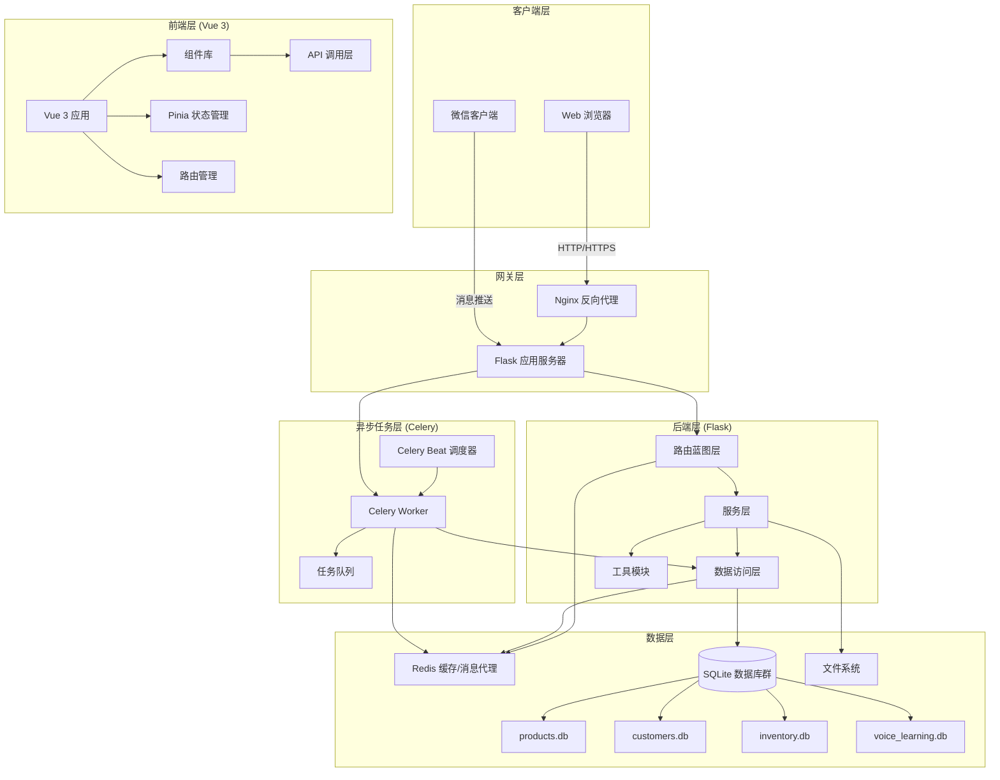
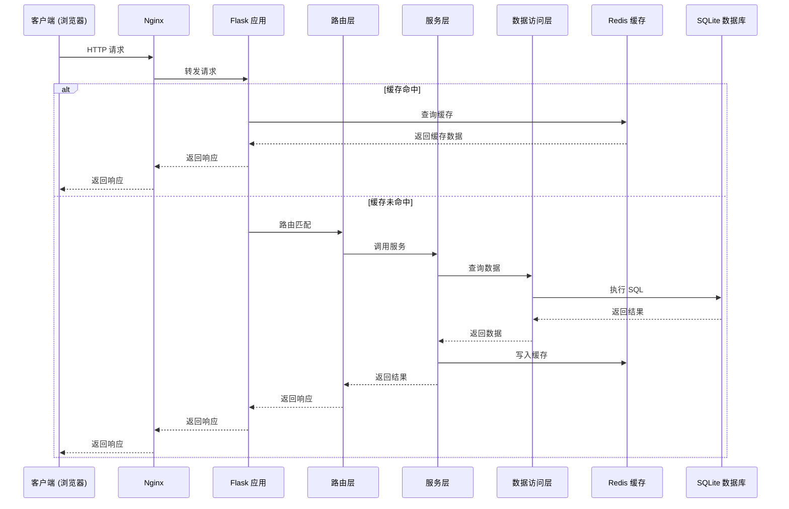
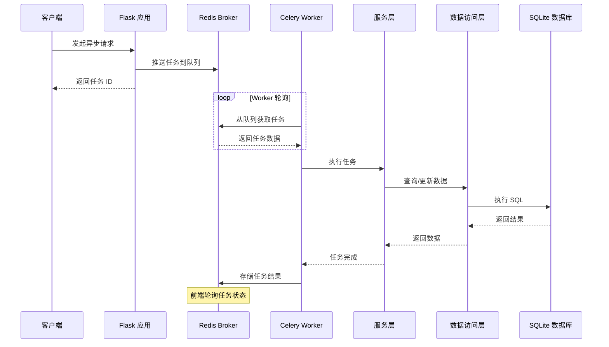
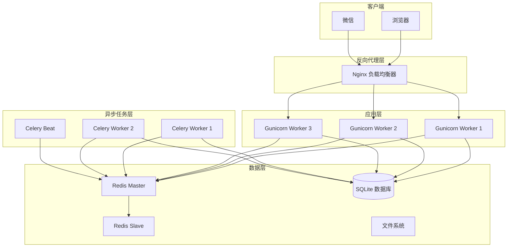

# XCAGI 系统架构设计文档

> 版本：1.0.0  
> 最后更新：2026-03-17  
> 维护者：XCAGI 开发团队

---

## 目录

1. [概述](#1-概述)
   - [项目背景](#11-项目背景)
   - [技术选型](#12-技术选型)
   - [系统目标](#13-系统目标)
2. [整体架构](#2-整体架构)
   - [系统架构图](#21-系统架构图)
   - [技术栈说明](#22-技术栈说明)
   - [系统分层](#23-系统分层)
3. [后端架构](#3-后端架构)
   - [Flask 应用工厂](#31-flask-应用工厂)
   - [蓝图路由系统](#32-蓝图路由系统)
   - [服务层设计](#33-服务层设计)
   - [数据访问层](#34-数据访问层)
4. [前端架构](#4-前端架构)
   - [Vue 3 组件化设计](#41-vue-3-组件化设计)
   - [状态管理 (Pinia)](#42-状态管理-pinia)
   - [路由管理](#43-路由管理)
   - [API 调用层](#44-api-调用层)
5. [异步任务架构](#5-异步任务架构)
   - [Celery 任务调度](#51-celery-任务调度)
   - [Redis Broker 配置](#52-redis-broker-配置)
   - [定期任务](#53-定期任务)
6. [数据流说明](#6-数据流说明)
   - [请求处理流程](#61-请求处理流程)
   - [异步任务流程](#62-异步任务流程)
   - [数据库操作流程](#63-数据库操作流程)
7. [部署架构](#7-部署架构)
   - [开发环境配置](#71-开发环境配置)
   - [生产环境配置](#72-生产环境配置)
   - [配置管理](#73-配置管理)

---

## 1. 概述

### 1.1 项目背景

XCAGI（Xiao Cheng AI）系统是一个集成了 AI 对话、微信消息处理、发货单管理、产品管理、物料管理等多功能于一体的企业级应用系统。系统旨在通过智能化手段提升企业运营效率，实现业务流程自动化和数据管理智能化。

**核心业务场景**：
- **AI 智能对话**：提供基于 AI 的智能客服和业务咨询功能
- **微信消息集成**：自动处理和响应微信消息，提取业务任务
- **发货单管理**：自动化生成和管理发货单据，支持 Excel 模板导入导出
- **产品与物料管理**：统一管理产品信息和物料库存
- **标签打印**：支持商标标签的批量打印和导出

**系统特点**：
- 前后端分离架构，支持独立开发和部署
- 异步任务处理，提升系统响应速度
- 模块化设计，易于扩展和维护
- 支持多数据库管理，数据隔离安全

### 1.2 技术选型

#### 后端技术栈

| 技术 | 版本 | 用途 |
|------|------|------|
| **Python** | 3.11+ | 主要编程语言 |
| **Flask** | 3.0.0 | Web 应用框架 |
| **Flask-CORS** | 4.0.0 | 跨域资源共享支持 |
| **Flask-Caching** | 2.1.0 | 缓存管理 |
| **Flasgger** | 0.9.7.1 | Swagger API 文档 |
| **Celery** | 5.3.4 | 分布式任务队列 |
| **Redis** | 5.0.1 | 缓存和消息代理 |
| **SQLAlchemy** | 2.0+ | ORM 框架 |
| **Alembic** | 1.13+ | 数据库迁移工具 |
| **openpyxl** | 3.1.2 | Excel 文件处理 |

#### 前端技术栈

| 技术 | 版本 | 用途 |
|------|------|------|
| **Vue.js** | 3.x | 前端框架 |
| **Vite** | 5.x | 构建工具 |
| **Pinia** | 2.x | 状态管理 |
| **Vue Router** | 4.x | 路由管理 |
| **Axios** | 1.x | HTTP 客户端 |

#### 基础设施

| 组件 | 用途 |
|------|------|
| **SQLite** | 主数据库（多文件） |
| **Redis** | 缓存、消息代理、Celery Broker |
| **Nginx** | 反向代理（生产环境） |
| **Gunicorn** | WSGI HTTP 服务器 |

### 1.3 系统目标

#### 功能性目标

1. **业务自动化**：通过 AI 和自动化技术减少人工操作
2. **数据集成**：统一管理多个业务数据库
3. **实时响应**：提供快速的 API 响应和实时数据处理
4. **可扩展性**：模块化设计支持功能快速扩展

#### 非功能性目标

1. **性能**：API 响应时间 < 200ms，页面加载时间 < 2s
2. **可用性**：系统可用性 > 99.5%
3. **可维护性**：代码覆盖率 > 80%，文档完整
4. **安全性**：数据加密传输，权限控制完善

---

## 2. 整体架构

### 2.1 系统架构图



### 2.2 技术栈说明

#### 后端框架选择理由

**Flask** 作为轻量级 Web 框架，具有以下优势：
- **灵活性**：插件化架构，按需加载扩展
- **简洁性**：核心代码简洁，易于理解和维护
- **生态丰富**：大量成熟扩展（CORS、Caching、Swagger 等）
- **性能优异**：适合中小型应用和微服务架构

#### 前端框架选择理由

**Vue 3** 作为现代前端框架，具有以下优势：
- **组合式 API**：更灵活的代码组织方式
- **性能优化**：虚拟 DOM 优化，渲染性能提升
- **TypeScript 支持**：更好的类型推导
- **生态完善**：Pinia、Vue Router 等官方支持

#### 异步任务选择理由

**Celery** 作为分布式任务队列，适合以下场景：
- **耗时任务**：Excel 处理、OCR 识别、批量打印
- **定期任务**：微信消息扫描、数据清理
- **任务调度**：支持定时任务和周期性任务

### 2.3 系统分层

系统采用经典的**三层架构**设计：

```
┌─────────────────────────────────────────┐
│           表现层 (Presentation)          │
│  ┌─────────┐  ┌─────────┐  ┌─────────┐ │
│  │  Vue.js │  │  组件   │  │  状态   │ │
│  │  应用   │  │  库     │  │  管理   │ │
│  └─────────┘  └─────────┘  └─────────┘ │
└─────────────────────────────────────────┘
                    ↓ HTTP/REST API
┌─────────────────────────────────────────┐
│           应用层 (Application)           │
│  ┌─────────┐  ┌─────────┐  ┌─────────┐ │
│  │  路由   │  │  服务   │  │  任务   │ │
│  │  层     │  │  层     │  │  层     │ │
│  └─────────┘  └─────────┘  └─────────┘ │
└─────────────────────────────────────────┘
                    ↓ ORM/SQL
┌─────────────────────────────────────────┐
│           数据层 (Data)                  │
│  ┌─────────┐  ┌─────────┐  ┌─────────┐ │
│  │  SQLite │  │  Redis │  │  文件   │ │
│  │  数据库 │  │  缓存   │  │  系统   │ │
│  └─────────┘  └─────────┘  └─────────┘ │
└─────────────────────────────────────────┘
```

---

## 3. 后端架构

### 3.1 Flask 应用工厂

XCAGI 采用**应用工厂模式**创建 Flask 实例，支持多环境配置和测试隔离。

#### 核心代码结构

```python
# app/__init__.py
from flask import Flask
from .config import Config, get_config
from .extensions import init_extensions

def create_app(config_object: type[Config] | None = None) -> Flask:
    """
    创建并配置 Flask 应用实例
    
    Args:
        config_object: 配置类，如果为 None 则使用默认配置
        
    Returns:
        配置好的 Flask 应用实例
    """
    # 创建 Flask 应用
    app = Flask(
        __name__,
        static_folder=os.path.join(BASE_DIR, "static"),
        template_folder=os.path.join(BASE_DIR, "templates"),
    )
    
    # 加载配置
    if config_object is None:
        config_object = get_config("default")
    app.config.from_object(config_object)
    
    # 初始化数据库
    initialize_databases()
    init_wechat_tasks_table()
    
    # 初始化 Swagger 文档
    swagger = Swagger(app, template={
        'title': 'XCAGI API Documentation',
        'description': 'XCAGI 系统 API 接口文档',
        'version': '1.0.0'
    })
    
    # 初始化扩展（缓存、Celery 等）
    init_extensions(app)
    
    # 注册路由蓝图
    register_blueprints(app)
    
    return app
```

#### 配置管理

```python
# app/config.py
class Config:
    """基础配置类"""
    
    # 安全密钥
    SECRET_KEY = os.environ.get("SECRET_KEY", "dev-secret-key")
    
    # 调试模式
    DEBUG = os.environ.get("FLASK_DEBUG", "1") == "1"
    
    # Redis / Cache 配置
    CACHE_REDIS_URL = os.environ.get("CACHE_REDIS_URL", "redis://localhost:6379/0")
    
    # Celery 配置
    CELERY = {
        "broker_url": os.environ.get("CELERY_BROKER_URL", "redis://localhost:6379/1"),
        "result_backend": os.environ.get("CELERY_RESULT_BACKEND", "redis://localhost:6379/2"),
        "task_serializer": "json",
        "result_serializer": "json",
        "accept_content": ["json"],
        "timezone": "Asia/Shanghai",
        "enable_utc": False,
    }

class DevelopmentConfig(Config):
    """开发环境配置"""
    DEBUG = True
    CACHE_REDIS_URL = "redis://localhost:6379/1"
    CELERY = {
        **Config.CELERY,
        "broker_url": "redis://localhost:6379/3",
        "result_backend": "redis://localhost:6379/4",
    }

class ProductionConfig(Config):
    """生产环境配置"""
    DEBUG = False
    
    @classmethod
    def init_app(cls):
        secret_key = os.environ.get("SECRET_KEY")
        if not secret_key:
            raise ValueError("生产环境必须设置 SECRET_KEY 环境变量")
        cls.SECRET_KEY = secret_key
```

### 3.2 蓝图路由系统

系统采用**蓝图（Blueprint）**组织路由，实现模块化开发。

#### 路由注册

```python
# app/routes/__init__.py
def register_blueprints(app: Flask) -> None:
    """注册所有路由蓝图"""
    from .frontend import frontend_bp
    from .tools import tools_bp
    from .customers import customers_bp
    from .products import products_bp
    from .shipment import shipment_bp
    from .wechat import wechat_bp
    from .ai_chat import ai_chat_bp
    from .print import print_bp
    from .ocr import ocr_bp
    from .excel_templates import excel_templates_bp
    from .excel_extract import excel_extract_bp
    from .materials import materials_bp
    from .conversations import conversations_bp

    app.register_blueprint(frontend_bp)
    app.register_blueprint(tools_bp)
    app.register_blueprint(customers_bp, url_prefix="/api/customers")
    app.register_blueprint(products_bp, url_prefix="/api/products")
    app.register_blueprint(shipment_bp, url_prefix="/api/shipment")
    app.register_blueprint(wechat_bp, url_prefix="/api/wechat")
    app.register_blueprint(ai_chat_bp, url_prefix="/api/ai")
    app.register_blueprint(print_bp, url_prefix="/api/print")
    app.register_blueprint(ocr_bp, url_prefix="/api/ocr")
    app.register_blueprint(excel_templates_bp, url_prefix="/api/excel")
    app.register_blueprint(excel_extract_bp, url_prefix="/api/excel/data")
    app.register_blueprint(materials_bp)
    app.register_blueprint(conversations_bp)
```

#### 路由模块职责

| 蓝图 | URL 前缀 | 职责 |
|------|----------|------|
| `frontend` | `/` | 前端页面路由 |
| `tools` | `/api/tools` | 工具接口 |
| `customers` | `/api/customers` | 客户管理 API |
| `products` | `/api/products` | 产品管理 API |
| `shipment` | `/api/shipment` | 发货单管理 API |
| `wechat` | `/api/wechat` | 微信集成 API |
| `ai_chat` | `/api/ai` | AI 对话 API |
| `print` | `/api/print` | 打印服务 API |
| `ocr` | `/api/ocr` | OCR 识别 API |
| `excel_templates` | `/api/excel` | Excel 模板管理 |
| `excel_extract` | `/api/excel/data` | Excel 数据提取 |
| `materials` | `/api/materials` | 物料管理 API |
| `conversations` | `/api/conversations` | 对话历史管理 |

### 3.3 服务层设计

服务层负责**业务逻辑处理**，协调数据访问层和工具模块完成复杂业务。

#### 服务层职责

1. **业务逻辑编排**：协调多个数据访问操作
2. **数据验证**：验证输入数据的完整性和正确性
3. **事务管理**：确保数据一致性
4. **异常处理**：统一处理业务异常

#### 服务层示例

```python
# 伪代码示例：发货单服务
class ShipmentService:
    """发货单业务服务"""
    
    def __init__(self):
        self.db = get_db_connection()
        self.template_manager = TemplateManager()
        self.print_service = PrintService()
    
    def create_shipment(self, customer_id, products, template_id):
        """
        创建发货单
        
        Args:
            customer_id: 客户 ID
            products: 产品列表 [{'product_id', 'quantity'}]
            template_id: 模板 ID
            
        Returns:
            dict: 创建结果 {'success': True, 'shipment_id': 123}
        """
        try:
            # 1. 验证客户信息
            customer = self.db.get_customer(customer_id)
            if not customer:
                raise ValueError("客户不存在")
            
            # 2. 验证产品库存
            for product in products:
                if not self._check_inventory(product['product_id'], product['quantity']):
                    raise ValueError(f"产品 {product['product_id']} 库存不足")
            
            # 3. 生成发货单记录
            shipment_id = self.db.create_shipment_record({
                'customer_id': customer_id,
                'products': products,
                'status': 'pending'
            })
            
            # 4. 生成 Excel 文件
            excel_path = self.template_manager.generate_excel(
                template_id, 
                {'shipment_id': shipment_id, 'customer': customer, 'products': products}
            )
            
            # 5. 更新状态
            self.db.update_shipment_status(shipment_id, 'completed')
            
            return {'success': True, 'shipment_id': shipment_id, 'excel_path': excel_path}
            
        except Exception as e:
            logger.error(f"创建发货单失败：{e}")
            return {'success': False, 'error': str(e)}
```

### 3.4 数据访问层

数据访问层负责**数据库操作**，提供统一的 ORM 接口。

#### 数据库结构

XCAGI 使用**多 SQLite 数据库文件**设计：

| 数据库文件 | 用途 | 主要表 |
|-----------|------|--------|
| `products.db` | 产品和业务数据 | `products`, `purchase_units`, `shipment_records` |
| `customers.db` | 客户信息 | `customers`, `purchase_units` |
| `inventory.db` | 库存管理 | `inventory`, `stock_logs` |
| `voice_learning.db` | 语音学习数据 | `voice_samples`, `learning_records` |
| `users.db` | 用户和会话 | `users`, `sessions` |
| `error_collection.db` | 错误日志 | `errors`, `error_logs` |

#### 数据库初始化

```python
# db.py
def initialize_databases():
    """初始化数据库（PyInstaller 打包环境需要）"""
    is_frozen = hasattr(sys, '_MEIPASS')
    source_dir = sys._MEIPASS if is_frozen else BASE_DIR
    work_dir = APP_DATA_DIR
    
    # 需要初始化的数据库文件
    db_files = [
        'products.db', 
        'customers.db', 
        'inventory.db', 
        'voice_learning.db', 
        'error_collection.db'
    ]
    
    for db_file in db_files:
        source_path = os.path.join(source_dir, db_file)
        work_path = os.path.join(work_dir, db_file)
        
        if not os.path.exists(work_path) and os.path.exists(source_path):
            shutil.copy2(source_path, work_path)
            logger.info(f"已复制数据库文件：{db_file}")
```

#### 数据访问示例

```python
# db.py
def query_db(sql, params=(), fetch_one=False):
    """
    查询数据库
    
    Args:
        sql: SQL 查询语句
        params: 查询参数
        fetch_one: 是否只返回一条记录
        
    Returns:
        查询结果列表或单条记录
    """
    try:
        conn = sqlite3.connect(get_db_path())
        conn.row_factory = sqlite3.Row
        cursor = conn.cursor()
        cursor.execute(sql, params)
        result = cursor.fetchone() if fetch_one else cursor.fetchall()
        conn.close()
        return result
    except Exception as e:
        logger.error(f"数据库查询失败：{e}")
        return None


def row_to_dict(row):
    """将 sqlite3.Row 对象转换为字典"""
    if row is None:
        return None
    return {key: row[key] for key in row.keys()}
```

---

## 4. 前端架构

### 4.1 Vue 3 组件化设计

前端采用**组件化架构**，按照功能和 UI 元素划分组件。

#### 组件目录结构

```
frontend/src/components/
├── MainLayout.vue          # 主布局组件
├── Sidebar.vue             # 侧边栏导航
├── ProMode.vue             # 专业模式组件
├── Modal.vue               # 模态框组件
├── FileImport.vue          # 文件导入组件
├── pro-mode/               # 专业模式子组件
│   ├── CodeRings.vue
│   ├── DigitalRainCanvas.vue
│   ├── JarvisChatPanel.vue
│   └── ...
└── pro-feature-widget/     # 专业功能组件
    ├── WeChatLoginPanel.vue
    ├── ProductQueryPanel.vue
    └── ...
```

#### 视图组件

```
frontend/src/views/
├── ChatView.vue              # AI 对话视图
├── ProductsView.vue          # 产品管理视图
├── MaterialsView.vue         # 物料管理视图
├── OrdersView.vue            # 订单管理视图
├── ShipmentRecordsView.vue   # 发货单视图
├── CustomersView.vue         # 客户管理视图
├── WechatContactsView.vue    # 微信联系人视图
├── PrintView.vue             # 打印服务视图
├── TemplatePreviewView.vue   # 模板预览视图
├── SettingsView.vue          # 系统设置视图
└── ToolsView.vue             # 工具管理视图
```

#### 组件通信模式

```vue
<!-- App.vue -->
<script setup>
import { ref } from 'vue'
import MainLayout from './components/MainLayout.vue'
import ProMode from './components/ProMode.vue'

const activeView = ref('chat')
const isProMode = ref(false)

const handleViewChange = (viewKey) => {
  activeView.value = viewKey
}

const handleToggleProMode = () => {
  isProMode.value = !isProMode.value
}
</script>

<template>
  <ProMode v-model="isProMode" />
  <MainLayout
    :active-view="activeView"
    :is-pro-mode="isProMode"
    @change-view="handleViewChange"
    @toggle-pro-mode="handleToggleProMode"
  >
    <component :is="views[activeView]" />
  </MainLayout>
</template>
```

### 4.2 状态管理 (Pinia)

使用 **Pinia** 进行全局状态管理，每个业务模块有独立 Store。

#### Store 结构

```
frontend/src/stores/
├── jarvisChat.js      # AI 对话状态
├── proMode.js         # 专业模式状态
├── productQuery.js    # 产品查询状态
└── workMode.js        # 工作模式状态
```

#### Store 示例

```javascript
// stores/jarvisChat.js
import { defineStore } from 'pinia'

export const useJarvisChatStore = defineStore('jarvisChat', {
  state: () => ({
    messages: [],
    isRecording: false,
    isPlaying: false,
    voiceQueue: [],
    currentTask: null,
    statusText: '准备就绪',
    isCoreSpeaking: false
  }),

  getters: {
    lastMessage: (state) => state.messages[state.messages.length - 1],
    hasPendingVoice: (state) => state.voiceQueue.length > 0
  },

  actions: {
    addMessage(content, type = 'ai') {
      this.messages.push({
        id: Date.now(),
        content,
        type,
        timestamp: new Date().toISOString()
      })
    },

    async sendMessage(message) {
      this.addMessage(message, 'user')
      
      // 调用 API 获取响应
      const response = await chatApi.sendMessage(message)
      this.addMessage(response, 'ai')
      this.queueVoice(response)
      
      return response
    },

    queueVoice(text) {
      this.voiceQueue.push(text)
      if (!this.isPlaying) {
        this.playNextVoice()
      }
    },

    playNextVoice() {
      if (this.voiceQueue.length === 0) {
        this.isPlaying = false
        this.isCoreSpeaking = false
        return
      }

      this.isPlaying = true
      this.isCoreSpeaking = true
      const text = this.voiceQueue.shift()
      this.speak(text)
    },

    speak(text) {
      if ('speechSynthesis' in window) {
        const utterance = new SpeechSynthesisUtterance(text)
        utterance.lang = 'zh-CN'
        
        utterance.onend = () => {
          setTimeout(() => {
            this.playNextVoice()
          }, 500)
        }
        
        window.speechSynthesis.speak(utterance)
      }
    }
  }
})
```

### 4.3 路由管理

前端路由采用**视图切换**模式，通过 `activeView` 状态管理当前视图。

#### 路由映射

```javascript
// App.vue
const views = {
  'chat': ChatView,
  'products': ProductsView,
  'materials': MaterialsView,
  'orders': OrdersView,
  'shipment-records': ShipmentRecordsView,
  'customers': CustomersView,
  'wechat-contacts': WechatContactsView,
  'print': PrintView,
  'template-preview': TemplatePreviewView,
  'settings': SettingsView,
  'tools': ToolsView
}
```

### 4.4 API 调用层

封装统一的 API 调用接口，使用 Axios 进行 HTTP 请求。

#### API 模块结构

```
frontend/src/api/
├── index.js         # Axios 实例配置
├── chat.js          # AI 对话 API
├── products.js      # 产品管理 API
├── customers.js     # 客户管理 API
├── orders.js        # 订单管理 API
├── materials.js     # 物料管理 API
├── wechat.js        # 微信集成 API
├── ocr.js           # OCR 识别 API
├── print.js         # 打印服务 API
├── excel.js         # Excel 处理 API
└── media.js         # 媒体管理 API
```

#### API 调用示例

```javascript
// api/index.js
import axios from 'axios'

const apiClient = axios.create({
  baseURL: '/api',
  timeout: 30000,
  headers: {
    'Content-Type': 'application/json'
  }
})

// 请求拦截器
apiClient.interceptors.request.use(
  config => {
    const token = localStorage.getItem('token')
    if (token) {
      config.headers.Authorization = `Bearer ${token}`
    }
    return config
  },
  error => {
    return Promise.reject(error)
  }
)

// 响应拦截器
apiClient.interceptors.response.use(
  response => response.data,
  error => {
    if (error.response) {
      switch (error.response.status) {
        case 401:
          // 未授权，跳转登录
          break
        case 403:
          // 禁止访问
          break
        case 404:
          // 资源不存在
          break
        case 500:
          // 服务器错误
          break
      }
    }
    return Promise.reject(error)
  }
)

export default apiClient
```

---

## 5. 异步任务架构

### 5.1 Celery 任务调度

系统使用 **Celery** 处理异步任务，包括耗时操作和定期任务。

#### Celery 配置

```python
# celery_app.py
from celery import Celery

celery_app = Celery(__name__)

# 从 Flask 配置加载 Celery 配置
celery_app.conf.update(
    broker_url='redis://localhost:6379/1',
    result_backend='redis://localhost:6379/2',
    task_serializer='json',
    result_serializer='json',
    accept_content=['json'],
    timezone='Asia/Shanghai',
    enable_utc=False,
)

# 自动发现任务
celery_app.autodiscover_tasks(['app.tasks'])
```

#### 任务示例

```python
# app/tasks/wechat_tasks.py
from celery_app import celery_app
import logging

logger = logging.getLogger(__name__)


@celery_app.task(bind=True, max_retries=3)
def scan_wechat_messages(self, limit=20):
    """
    扫描微信消息并提取任务
    
    Args:
        limit: 每次扫描的消息数量限制
    """
    try:
        logger.info(f"开始扫描微信消息，限制：{limit}")
        
        # 调用微信 API 获取消息
        messages = wechat_api.get_messages(limit=limit)
        
        for message in messages:
            # 解析消息内容
            task_data = parse_message(message)
            
            if task_data:
                # 创建任务记录
                insert_or_ignore_wechat_task(**task_data)
                
        logger.info(f"扫描完成，处理 {len(messages)} 条消息")
        return {'success': True, 'count': len(messages)}
        
    except Exception as e:
        logger.error(f"扫描微信消息失败：{e}")
        # 重试机制
        raise self.retry(exc=e, countdown=60)


@celery_app.task
def cleanup_old_tasks(days=30):
    """
    清理旧任务记录
    
    Args:
        days: 保留天数
    """
    cutoff_date = datetime.now() - timedelta(days=days)
    
    count = db.delete_tasks_before(cutoff_date)
    logger.info(f"清理 {count} 条旧任务记录")
    
    return {'success': True, 'deleted': count}
```

### 5.2 Redis Broker 配置

Redis 作为 Celery 的**消息代理**和**结果后端**，同时用于应用缓存。

#### Redis 数据库规划

| 数据库 ID | 用途 | 说明 |
|----------|------|------|
| 0 | 应用缓存 | Flask-Caching |
| 1 | 开发缓存 | 开发环境专用 |
| 2 | Celery 结果 | Celery 任务结果存储 |
| 3 | 开发 Broker | 开发环境消息代理 |
| 4 | 开发 Backend | 开发环境结果后端 |

#### 配置示例

```python
# app/config.py
class Config:
    # 缓存配置
    CACHE_REDIS_URL = "redis://localhost:6379/0"
    
    # Celery 配置
    CELERY = {
        "broker_url": "redis://localhost:6379/1",
        "result_backend": "redis://localhost:6379/2",
    }

class DevelopmentConfig(Config):
    # 开发环境使用不同的 Redis 数据库
    CACHE_REDIS_URL = "redis://localhost:6379/1"
    CELERY = {
        **Config.CELERY,
        "broker_url": "redis://localhost:6379/3",
        "result_backend": "redis://localhost:6379/4",
    }
```

### 5.3 定期任务

使用 **Celery Beat** 调度定期任务。

```python
# celery_app.py
celery_app.conf.beat_schedule = {
    'scan-wechat-messages': {
        'task': 'app.tasks.wechat_tasks.scan_wechat_messages',
        'schedule': 30.0,  # 每 30 秒扫描一次
        'options': {'limit': 20}
    },
    'cleanup-old-tasks': {
        'task': 'app.tasks.wechat_tasks.cleanup_old_tasks',
        'schedule': 86400.0,  # 每天执行一次
        'options': {'days': 30}
    },
    'cleanup-old-documents': {
        'task': 'app.tasks.shipment_tasks.cleanup_old_shipment_documents',
        'schedule': 86400.0,  # 每天执行一次
        'options': {'days': 90}
    },
}

# 任务路由
celery_app.conf.task_routes = {
    'app.tasks.wechat_tasks.*': {'queue': 'wechat'},
    'app.tasks.shipment_tasks.*': {'queue': 'shipment'},
}
```

---

## 6. 数据流说明

### 6.1 请求处理流程

#### HTTP 请求处理流程



#### 请求处理步骤

1. **客户端发起请求**：浏览器发送 HTTP/HTTPS 请求
2. **Nginx 反向代理**：接收请求并转发到 Flask 应用
3. **Flask 路由匹配**：根据 URL 匹配对应的蓝图路由
4. **缓存检查**：查询 Redis 缓存，命中则直接返回
5. **服务层处理**：执行业务逻辑，协调数据访问
6. **数据访问**：查询 SQLite 数据库
7. **缓存写入**：将结果写入 Redis 缓存
8. **响应返回**：逐层返回响应到客户端

### 6.2 异步任务流程

#### Celery 任务执行流程



#### 任务提交流程

```python
# 路由层
@shipment_bp.route('/export', methods=['POST'])
def export_shipment():
    data = request.get_json()
    
    # 提交异步任务
    task = export_shipment_task.delay(data)
    
    # 返回任务 ID
    return jsonify({
        'success': True,
        'task_id': task.id
    })


# 前端轮询任务状态
const checkTaskStatus = async (taskId) => {
  const response = await fetch(`/api/task/${taskId}`)
  const result = await response.json()
  
  if (result.state === 'SUCCESS') {
    // 任务完成，处理结果
    downloadFile(result.result.file_path)
  } else if (result.state === 'FAILURE') {
    // 任务失败，显示错误
    showError(result.result.error)
  } else {
    // 任务进行中，继续轮询
    setTimeout(() => checkTaskStatus(taskId), 1000)
  }
}
```

### 6.3 数据库操作流程

#### 数据库操作封装

```python
# 数据访问层封装
class DatabaseManager:
    """数据库管理器"""
    
    def __init__(self, db_path):
        self.db_path = db_path
    
    def get_connection(self):
        """获取数据库连接"""
        return sqlite3.connect(self.db_path)
    
    def query(self, sql, params=(), fetch_one=False):
        """查询数据"""
        conn = self.get_connection()
        conn.row_factory = sqlite3.Row
        cursor = conn.cursor()
        
        try:
            cursor.execute(sql, params)
            result = cursor.fetchone() if fetch_one else cursor.fetchall()
            return result
        finally:
            conn.close()
    
    def execute(self, sql, params=()):
        """执行数据库操作"""
        conn = self.get_connection()
        cursor = conn.cursor()
        
        try:
            cursor.execute(sql, params)
            conn.commit()
            return cursor.lastrowid
        except Exception as e:
            conn.rollback()
            logger.error(f"数据库操作失败：{e}")
            raise
        finally:
            conn.close()
```

#### 事务处理

```python
def create_shipment_with_transaction(customer_id, products):
    """
    使用事务创建发货单
    
    Args:
        customer_id: 客户 ID
        products: 产品列表
    """
    conn = sqlite3.connect(get_db_path())
    cursor = conn.cursor()
    
    try:
        # 开启事务
        cursor.execute("BEGIN")
        
        # 1. 插入发货单记录
        cursor.execute(
            "INSERT INTO shipment_records (customer_id, status, created_at) VALUES (?, ?, ?)",
            (customer_id, 'pending', datetime.now())
        )
        shipment_id = cursor.lastrowid
        
        # 2. 插入产品明细
        for product in products:
            cursor.execute(
                "INSERT INTO shipment_items (shipment_id, product_id, quantity) VALUES (?, ?, ?)",
                (shipment_id, product['id'], product['quantity'])
            )
        
        # 3. 更新库存
        for product in products:
            cursor.execute(
                "UPDATE products SET stock = stock - ? WHERE id = ?",
                (product['quantity'], product['id'])
            )
        
        # 提交事务
        conn.commit()
        logger.info(f"发货单创建成功：{shipment_id}")
        return shipment_id
        
    except Exception as e:
        # 回滚事务
        conn.rollback()
        logger.error(f"创建发货单失败：{e}")
        raise
    finally:
        conn.close()
```

---

## 7. 部署架构

### 7.1 开发环境配置

#### 开发环境组件

```
┌─────────────────────────────────────────┐
│           开发环境架构                   │
├─────────────────────────────────────────┤
│  ┌─────────┐  ┌─────────┐  ┌─────────┐ │
│  │   Vue   │  │  Flask  │  │  Redis  │ │
│  │  Dev    │  │   Dev   │  │  Server │ │
│  │ Server  │  │ Server  │  │         │ │
│  │ :5173   │  │ :5000   │  │ :6379   │ │
│  └─────────┘  └─────────┘  └─────────┘ │
│  ┌─────────┐  ┌─────────┐              │
│  │ Celery  │  │ Celery  │              │
│  │ Worker  │  │  Beat   │              │
│  └─────────┘  └─────────┘              │
└─────────────────────────────────────────┘
```

#### 启动脚本

```bash
# run.py - 开发环境启动脚本
#!/usr/bin/env python3
import os
from app import create_app
from app.config import DevelopmentConfig

# 创建 Flask 应用
app = create_app(DevelopmentConfig)

if __name__ == '__main__':
    # 启动 Flask 开发服务器
    app.run(
        host='0.0.0.0',
        port=5000,
        debug=True,
        threaded=True
    )
```

#### 开发环境依赖

```bash
# 安装 Python 依赖
pip install -r requirements.txt

# 安装前端依赖
cd frontend
npm install

# 启动 Redis
redis-server

# 启动 Flask 开发服务器
python run.py

# 启动 Celery Worker (新终端)
celery -A celery_app worker -l info -Q default,wechat,shipment

# 启动 Celery Beat (新终端)
celery -A celery_app beat -l info

# 启动前端开发服务器 (新终端)
cd frontend
npm run dev
```

### 7.2 生产环境配置

#### 生产环境架构



#### Gunicorn 配置

```python
# gunicorn_config.py
import multiprocessing

# 服务器绑定
bind = "0.0.0.0:8000"

# Worker 进程数
workers = multiprocessing.cpu_count() * 2 + 1

# Worker 类型
worker_class = "sync"

# 单 Worker 最大连接数
worker_connections = 1000

# 最大请求数（超过后重启 Worker）
max_requests = 1000
max_requests_jitter = 50

# 超时设置
timeout = 120
keepalive = 5

# 进程命名
proc_name = "xcagi"

# 日志配置
accesslog = "logs/gunicorn_access.log"
errorlog = "logs/gunicorn_error.log"
loglevel = "info"
```

#### Nginx 配置

```nginx
# /etc/nginx/sites-available/xcagi
upstream xcagi_backend {
    server 127.0.0.1:8000;
    keepalive 32;
}

server {
    listen 80;
    server_name xcagi.example.com;
    
    # 日志
    access_log /var/log/nginx/xcagi_access.log;
    error_log /var/log/nginx/xcagi_error.log;
    
    # 静态文件
    location /static/ {
        alias /path/to/xcagi/static/;
        expires 30d;
        add_header Cache-Control "public, immutable";
    }
    
    # 前端静态文件
    location /templates/vue-dist/ {
        alias /path/to/xcagi/templates/vue-dist/;
        expires 7d;
        add_header Cache-Control "public";
    }
    
    # API 代理
    location /api/ {
        proxy_pass http://xcagi_backend;
        proxy_set_header Host $host;
        proxy_set_header X-Real-IP $remote_addr;
        proxy_set_header X-Forwarded-For $proxy_add_x_forwarded_for;
        proxy_set_header X-Forwarded-Proto $scheme;
        
        proxy_connect_timeout 60s;
        proxy_send_timeout 120s;
        proxy_read_timeout 120s;
    }
    
    # WebSocket 支持（如果需要）
    location /ws/ {
        proxy_pass http://xcagi_backend;
        proxy_http_version 1.1;
        proxy_set_header Upgrade $http_upgrade;
        proxy_set_header Connection "upgrade";
    }
}
```

#### Systemd 服务配置

```ini
# /etc/systemd/system/xcagi.service
[Unit]
Description=XCAGI Flask Application
After=network.target redis.service

[Service]
Type=notify
User=www-data
Group=www-data
WorkingDirectory=/path/to/xcagi
Environment="PATH=/path/to/venv/bin"
ExecStart=/path/to/venv/bin/gunicorn --config gunicorn_config.py run:app

Restart=on-failure
RestartSec=10s

[Install]
WantedBy=multi-user.target
```

```ini
# /etc/systemd/system/xcagi-worker.service
[Unit]
Description=XCAGI Celery Worker
After=network.target redis.service

[Service]
Type=notify
User=www-data
Group=www-data
WorkingDirectory=/path/to/xcagi
Environment="PATH=/path/to/venv/bin"
ExecStart=/path/to/venv/bin/celery -A celery_app worker -l info -Q default,wechat,shipment

Restart=on-failure
RestartSec=10s

[Install]
WantedBy=multi-user.target
```

```ini
# /etc/systemd/system/xcagi-beat.service
[Unit]
Description=XCAGI Celery Beat
After=network.target redis.service

[Service]
Type=simple
User=www-data
Group=www-data
WorkingDirectory=/path/to/xcagi
Environment="PATH=/path/to/venv/bin"
ExecStart=/path/to/venv/bin/celery -A celery_app beat -l info

Restart=on-failure
RestartSec=10s

[Install]
WantedBy=multi-user.target
```

### 7.3 配置管理

#### 环境变量配置

```bash
# .env.example - 环境变量模板

# Flask 配置
FLASK_ENV=production
FLASK_DEBUG=0
SECRET_KEY=your-secret-key-here

# Redis 配置
CACHE_REDIS_URL=redis://localhost:6379/0
CELERY_BROKER_URL=redis://localhost:6379/1
CELERY_RESULT_BACKEND=redis://localhost:6379/2

# 数据库配置
DATABASE_PATH=/path/to/data

# 上传文件配置
UPLOAD_FOLDER=/path/to/uploads
MAX_CONTENT_LENGTH=16777216

# 日志配置
LOG_LEVEL=INFO

# 微信配置（如果需要）
WECHAT_API_KEY=your-wechat-api-key
```

#### 配置加载

```python
# app/config.py
from dotenv import load_dotenv

# 加载环境变量
load_dotenv()

class Config:
    SECRET_KEY = os.environ.get("SECRET_KEY")
    DEBUG = os.environ.get("FLASK_DEBUG", "0") == "1"
    CACHE_REDIS_URL = os.environ.get("CACHE_REDIS_URL")
    CELERY = {
        "broker_url": os.environ.get("CELERY_BROKER_URL"),
        "result_backend": os.environ.get("CELERY_RESULT_BACKEND"),
    }
```

#### 部署检查清单

- [ ] 设置生产环境 `SECRET_KEY`
- [ ] 配置 Redis 服务器
- [ ] 配置 Nginx 反向代理
- [ ] 配置 Gunicorn WSGI 服务器
- [ ] 配置 Systemd 服务
- [ ] 配置日志轮转
- [ ] 配置数据库备份
- [ ] 配置 SSL 证书（HTTPS）
- [ ] 配置防火墙规则
- [ ] 配置监控告警

---

## 附录

### A. 端口规划

| 服务 | 端口 | 说明 |
|------|------|------|
| Flask Dev | 5000 | 开发环境 Flask 服务器 |
| Vite Dev | 5173 | 开发环境前端服务器 |
| Redis | 6379 | Redis 服务器 |
| Gunicorn | 8000 | 生产环境 WSGI 服务器 |
| Nginx | 80/443 | HTTP/HTTPS 服务器 |

### B. 目录结构

```
XCAGI/
├── app/                      # Flask 应用
│   ├── __init__.py          # 应用工厂
│   ├── config.py            # 配置管理
│   ├── extensions.py        # 扩展初始化
│   ├── routes/              # 路由蓝图
│   ├── tasks/               # Celery 任务
│   ├── utils/               # 工具模块
│   └── db/                  # 数据访问层
├── frontend/                 # Vue 3 前端
│   ├── src/
│   │   ├── api/             # API 调用
│   │   ├── components/      # 组件
│   │   ├── stores/          # Pinia 状态
│   │   ├── views/           # 视图
│   │   └── main.js          # 入口文件
│   └── package.json
├── templates/                # Excel 模板
├── static/                   # 静态文件
├── data/                     # 数据目录
├── logs/                     # 日志目录
├── celery_app.py            # Celery 配置
├── run.py                   # 启动脚本
└── requirements.txt         # Python 依赖
```

### C. 参考资料

- [Flask 官方文档](https://flask.palletsprojects.com/)
- [Vue 3 官方文档](https://vuejs.org/)
- [Celery 官方文档](https://docs.celeryq.dev/)
- [Pinia 官方文档](https://pinia.vuejs.org/)
- [SQLAlchemy 官方文档](https://docs.sqlalchemy.org/)

---

**文档版本历史**

| 版本 | 日期 | 作者 | 说明 |
|------|------|------|------|
| 1.0.0 | 2026-03-17 | XCAGI 开发团队 | 初始版本 |
