# XCAGI 项目数据库 ER 图文档

## 1. 数据库概述

### 1.1 数据库简介

XCAGI 项目采用 **SQLite 3** 作为关系型数据库管理系统，用于存储和管理系统的核心业务数据。SQLite 是一款轻量级、嵌入式、高性能的数据库引擎，特别适合本项目的单机部署场景。

### 1.2 数据库文件位置

项目使用多个独立的 SQLite 数据库文件，分别存储不同类型的业务数据：

| 数据库文件 | 存储路径 | 用途说明 |
|-----------|---------|---------|
| `products.db` | `e:\FHD\XCAGI\products.db` | 主业务数据库：产品、发货记录、购货单位、微信任务等 |
| `users.db` | `e:\FHD\XCAGI\users.db` | 用户认证数据库：用户账户、会话管理 |
| `customers.db` | `e:\FHD\XCAGI\customers.db` | 客户信息数据库：客户资料、联系人信息 |
| `inventory.db` | `e:\FHD\XCAGI\inventory.db` | 库存管理数据库 |
| `voice_learning.db` | `e:\FHD\XCAGI\voice_learning.db` | 语音学习数据 |
| `error_collection.db` | `e:\FHD\XCAGI\error_collection.db` | 错误日志收集 |

### 1.3 Alembic 数据库迁移

项目使用 **Alembic** 作为数据库版本管理工具，支持数据库结构的迭代升级和回滚。

#### 迁移历史

| 版本号 | 迁移名称 | 创建日期 | 说明 |
|-------|---------|---------|------|
| `202d63cb1c33` | initial_schema | 2026-03-17 00:56:42 | 初始数据库结构（标记现有表） |
| `a7d310349a7d` | add_recommended_indexes | 2026-03-17 01:24:14 | 添加推荐索引优化查询性能 |

#### 迁移命令

```bash
# 查看当前迁移状态
alembic current

# 升级到最新版本
alembic upgrade head

# 降级到指定版本
alembic downgrade 202d63cb1c33

# 创建新的迁移
alembic revision -m "描述迁移内容"
```

### 1.4 SQLite 性能优化配置

数据库连接时自动应用以下优化参数：

```sql
PRAGMA journal_mode=WAL;           -- 预写日志模式，提高并发性能
PRAGMA synchronous=NORMAL;         -- 平衡安全性和性能
PRAGMA cache_size=-64000;          -- 64MB 缓存大小
PRAGMA foreign_keys=ON;            -- 启用外键约束
```

---

## 2. 数据表结构

### 2.1 用户管理模块

#### 2.1.1 用户表（users）

存储系统用户账户信息。

| 字段名 | 数据类型 | 约束 | 默认值 | 说明 |
|-------|---------|------|-------|------|
| `id` | INTEGER | PRIMARY KEY, AUTOINCREMENT | - | 用户 ID |
| `username` | TEXT | UNIQUE, NOT NULL | - | 用户名（登录账号） |
| `password` | TEXT | NOT NULL | - | 密码（SHA256 哈希） |
| `display_name` | TEXT | - | '' | 显示名称 |
| `role` | TEXT | - | 'user' | 角色（admin/user） |
| `created_at` | TIMESTAMP | - | CURRENT_TIMESTAMP | 创建时间 |
| `last_login` | TIMESTAMP | - | NULL | 最后登录时间 |

**约束条件：**
- 主键：`id`
- 唯一约束：`username`
- 非空约束：`username`, `password`

**索引：**
- 自动创建：`username`（UNIQUE 索引）

---

#### 2.1.2 会话表（sessions）

存储用户登录会话信息，用于身份验证和会话管理。

| 字段名 | 数据类型 | 约束 | 默认值 | 说明 |
|-------|---------|------|-------|------|
| `id` | INTEGER | PRIMARY KEY, AUTOINCREMENT | - | 会话 ID |
| `session_id` | TEXT | UNIQUE, NOT NULL | - | 会话令牌（UUID） |
| `user_id` | INTEGER | NOT NULL, FOREIGN KEY | - | 关联用户 ID |
| `created_at` | TIMESTAMP | - | CURRENT_TIMESTAMP | 创建时间 |
| `expires_at` | TIMESTAMP | NOT NULL | - | 过期时间 |

**约束条件：**
- 主键：`id`
- 唯一约束：`session_id`
- 非空约束：`session_id`, `user_id`, `expires_at`
- 外键约束：`user_id` REFERENCES `users(id)`

**索引：**
- 自动创建：`session_id`（UNIQUE 索引）

---

### 2.2 产品管理模块

#### 2.2.1 产品表（products）

存储产品基本信息和库存数据。

| 字段名 | 数据类型 | 约束 | 默认值 | 说明 |
|-------|---------|------|-------|------|
| `id` | INTEGER | PRIMARY KEY, AUTOINCREMENT | - | 产品 ID |
| `model_number` | TEXT | - | NULL | 型号/产品编号 |
| `name` | TEXT | NOT NULL | - | 产品名称 |
| `specification` | TEXT | - | NULL | 规格型号 |
| `price` | FLOAT | - | 0.0 | 单价（元） |
| `quantity` | INTEGER | - | NULL | 库存数量 |
| `description` | TEXT | - | NULL | 产品描述 |
| `category` | TEXT | - | NULL | 产品类别 |
| `brand` | TEXT | - | NULL | 品牌 |
| `unit` | TEXT | - | '个' | 计量单位 |
| `is_active` | INTEGER | - | 1 | 是否启用（1=启用，0=禁用） |
| `created_at` | TIMESTAMP | - | NULL | 创建时间 |
| `updated_at` | TIMESTAMP | - | NULL | 更新时间 |

**约束条件：**
- 主键：`id`
- 非空约束：`name`

**索引：**
- `idx_products_model`：`model_number`（普通索引）
- `idx_products_name`：`name`（普通索引）

---

### 2.3 发货管理模块

#### 2.3.1 发货记录表（shipment_records）

存储产品发货记录，支持发货单打印和物流跟踪。

| 字段名 | 数据类型 | 约束 | 默认值 | 说明 |
|-------|---------|------|-------|------|
| `id` | INTEGER | PRIMARY KEY, AUTOINCREMENT | - | 发货记录 ID |
| `purchase_unit` | TEXT | NOT NULL | - | 购货单位名称 |
| `unit_id` | INTEGER | - | NULL | 购货单位 ID（外键引用） |
| `product_name` | TEXT | NOT NULL | - | 产品名称 |
| `model_number` | TEXT | - | NULL | 产品型号 |
| `quantity_kg` | FLOAT | NOT NULL | - | 发货重量（kg） |
| `quantity_tins` | INTEGER | NOT NULL | - | 发货罐数 |
| `tin_spec` | FLOAT | - | NULL | 单罐规格（kg/罐） |
| `unit_price` | FLOAT | - | 0 | 单价（元/kg） |
| `amount` | FLOAT | - | 0 | 总金额（元） |
| `status` | TEXT | - | 'pending' | 状态（pending/shipped/delivered） |
| `created_at` | TIMESTAMP | - | NULL | 创建时间 |
| `updated_at` | TIMESTAMP | - | NULL | 更新时间 |
| `printed_at` | TIMESTAMP | - | NULL | 打印时间 |
| `printer_name` | TEXT | - | NULL | 打印机名称 |
| `raw_text` | TEXT | - | NULL | 原始解析文本 |
| `parsed_data` | TEXT | - | NULL | 解析后的 JSON 数据 |

**约束条件：**
- 主键：`id`
- 非空约束：`purchase_unit`, `product_name`, `quantity_kg`, `quantity_tins`

**索引：**
- `idx_shipment_records_unit_date`：`(purchase_unit, created_at)`（复合索引）
- `idx_shipment_records_created`：`created_at`（普通索引）

---

### 2.4 购货单位模块

#### 2.4.1 购货单位表（purchase_units）

存储购货单位（客户公司）信息。

| 字段名 | 数据类型 | 约束 | 默认值 | 说明 |
|-------|---------|------|-------|------|
| `id` | INTEGER | PRIMARY KEY, AUTOINCREMENT | - | 单位 ID |
| `unit_name` | TEXT | NOT NULL | - | 单位名称 |
| `contact_person` | TEXT | - | NULL | 联系人 |
| `contact_phone` | TEXT | - | NULL | 联系电话 |
| `address` | TEXT | - | NULL | 地址 |
| `discount_rate` | FLOAT | - | 1.0 | 折扣率 |
| `is_active` | INTEGER | - | 1 | 是否启用 |
| `created_at` | TIMESTAMP | - | NULL | 创建时间 |
| `updated_at` | TIMESTAMP | - | NULL | 更新时间 |

**约束条件：**
- 主键：`id`
- 非空约束：`unit_name`

**索引：**
- `idx_purchase_units_name_active`：`(unit_name, is_active)`（复合索引）

---

### 2.5 微信集成模块

#### 2.5.1 微信任务表（wechat_tasks）

存储从微信消息解析出来的任务记录。

| 字段名 | 数据类型 | 约束 | 默认值 | 说明 |
|-------|---------|------|-------|------|
| `id` | INTEGER | PRIMARY KEY, AUTOINCREMENT | - | 任务 ID |
| `contact_id` | INTEGER | - | NULL | 联系人 ID |
| `username` | TEXT | - | NULL | 微信用户名 |
| `display_name` | TEXT | - | NULL | 显示名称 |
| `message_id` | TEXT | - | NULL | 微信消息 ID |
| `msg_timestamp` | INTEGER | - | NULL | 消息时间戳 |
| `raw_text` | TEXT | NOT NULL | - | 原始消息文本 |
| `task_type` | TEXT | NOT NULL | 'unknown' | 任务类型（product_query/order/shipment） |
| `status` | TEXT | NOT NULL | 'pending' | 状态（pending/confirmed/done/ignored） |
| `last_status_at` | TIMESTAMP | - | CURRENT_TIMESTAMP | 最后状态变更时间 |
| `created_at` | TIMESTAMP | - | CURRENT_TIMESTAMP | 创建时间 |
| `updated_at` | TIMESTAMP | - | CURRENT_TIMESTAMP | 更新时间 |

**约束条件：**
- 主键：`id`
- 非空约束：`raw_text`, `task_type`, `status`

**索引：**
- `idx_wechat_tasks_contact_status`：`(contact_id, status)`（复合索引）
- `idx_wechat_tasks_msg_unique`：`(message_id, username)`（UNIQUE 索引）

---

#### 2.5.2 微信联系人表（wechat_contacts）

存储微信联系人信息。

| 字段名 | 数据类型 | 约束 | 默认值 | 说明 |
|-------|---------|------|-------|------|
| `id` | INTEGER | PRIMARY KEY, AUTOINCREMENT | - | 联系人 ID |
| `contact_name` | TEXT | NOT NULL | - | 联系人名称 |
| `remark` | TEXT | - | NULL | 备注 |
| `wechat_id` | TEXT | - | NULL | 微信 ID |
| `contact_type` | TEXT | - | 'contact' | 类型（contact/group） |
| `is_active` | INTEGER | - | 1 | 是否启用 |
| `is_starred` | INTEGER | - | 0 | 是否星标 |
| `created_at` | TIMESTAMP | - | CURRENT_TIMESTAMP | 创建时间 |
| `updated_at` | TIMESTAMP | - | CURRENT_TIMESTAMP | 更新时间 |

**约束条件：**
- 主键：`id`
- 非空约束：`contact_name`

**索引：**
- `idx_wechat_contacts_type_active`：`(contact_type, is_active)`（复合索引）

---

#### 2.5.3 微信联系人上下文表（wechat_contact_context）

存储微信联系人的对话上下文信息。

| 字段名 | 数据类型 | 约束 | 默认值 | 说明 |
|-------|---------|------|-------|------|
| `id` | INTEGER | PRIMARY KEY, AUTOINCREMENT | - | 上下文 ID |
| `contact_id` | INTEGER | NOT NULL | - | 联系人 ID |
| `wechat_id` | TEXT | - | NULL | 微信 ID |
| `context_json` | TEXT | - | NULL | 上下文 JSON 数据 |
| `message_count` | INTEGER | - | 0 | 消息数量 |
| `updated_at` | TIMESTAMP | - | CURRENT_TIMESTAMP | 更新时间 |

**约束条件：**
- 主键：`id`
- 非空约束：`contact_id`

---

### 2.6 AI 工具模块

#### 2.6.1 AI 工具分类表（ai_tool_categories）

存储 AI 工具的分类信息。

| 字段名 | 数据类型 | 约束 | 默认值 | 说明 |
|-------|---------|------|-------|------|
| `id` | INTEGER | PRIMARY KEY, AUTOINCREMENT | - | 分类 ID |
| `category_name` | TEXT | NOT NULL | - | 分类名称 |
| `category_key` | TEXT | UNIQUE, NOT NULL | - | 分类标识符 |
| `description` | TEXT | - | NULL | 分类描述 |
| `icon` | TEXT | - | NULL | 图标 |
| `sort_order` | INTEGER | - | 0 | 排序顺序 |
| `is_active` | INTEGER | - | 1 | 是否启用 |
| `created_at` | TIMESTAMP | - | NULL | 创建时间 |
| `updated_at` | TIMESTAMP | - | NULL | 更新时间 |

**约束条件：**
- 主键：`id`
- 唯一约束：`category_key`
- 非空约束：`category_name`, `category_key`

---

#### 2.6.2 AI 工具表（ai_tools）

存储 AI 工具定义信息。

| 字段名 | 数据类型 | 约束 | 默认值 | 说明 |
|-------|---------|------|-------|------|
| `id` | INTEGER | PRIMARY KEY, AUTOINCREMENT | - | 工具 ID |
| `tool_key` | TEXT | UNIQUE, NOT NULL | - | 工具标识符 |
| `name` | TEXT | NOT NULL | - | 工具名称 |
| `category_id` | INTEGER | - | NULL | 分类 ID（外键引用） |
| `description` | TEXT | - | NULL | 工具描述 |
| `parameters` | TEXT | - | NULL | 参数定义（JSON） |
| `is_active` | INTEGER | - | 1 | 是否启用 |
| `created_at` | TIMESTAMP | - | NULL | 创建时间 |
| `updated_at` | TIMESTAMP | - | NULL | 更新时间 |

**约束条件：**
- 主键：`id`
- 唯一约束：`tool_key`
- 非空约束：`tool_key`, `name`

---

#### 2.6.3 AI 对话表（ai_conversations）

存储 AI 对话历史记录。

| 字段名 | 数据类型 | 约束 | 默认值 | 说明 |
|-------|---------|------|-------|------|
| `id` | INTEGER | PRIMARY KEY, AUTOINCREMENT | - | 对话记录 ID |
| `session_id` | TEXT | NOT NULL | - | 会话 ID |
| `user_id` | TEXT | - | NULL | 用户 ID |
| `role` | TEXT | NOT NULL | - | 角色（user/assistant/system） |
| `content` | TEXT | NOT NULL | - | 对话内容 |
| `intent` | TEXT | - | NULL | 意图识别结果 |
| `conversation_metadata` | TEXT | - | NULL | 对话元数据（JSON） |
| `created_at` | TIMESTAMP | - | NULL | 创建时间 |

**约束条件：**
- 主键：`id`
- 非空约束：`session_id`, `role`, `content`

---

#### 2.6.4 AI 对话会话表（ai_conversation_sessions）

存储 AI 对话会话信息。

| 字段名 | 数据类型 | 约束 | 默认值 | 说明 |
|-------|---------|------|-------|------|
| `id` | INTEGER | PRIMARY KEY, AUTOINCREMENT | - | 会话 ID |
| `session_id` | TEXT | UNIQUE, NOT NULL | - | 会话唯一标识 |
| `user_id` | TEXT | - | NULL | 用户 ID |
| `title` | TEXT | - | NULL | 会话标题 |
| `summary` | TEXT | - | NULL | 会话摘要 |
| `message_count` | INTEGER | - | 0 | 消息数量 |
| `last_message_at` | TIMESTAMP | - | NULL | 最后消息时间 |
| `created_at` | TIMESTAMP | - | NULL | 创建时间 |

**约束条件：**
- 主键：`id`
- 唯一约束：`session_id`
- 非空约束：`session_id`

---

#### 2.6.5 用户偏好表（user_preferences）

存储用户个性化偏好设置。

| 字段名 | 数据类型 | 约束 | 默认值 | 说明 |
|-------|---------|------|-------|------|
| `id` | INTEGER | PRIMARY KEY, AUTOINCREMENT | - | 偏好 ID |
| `user_id` | TEXT | NOT NULL | - | 用户 ID |
| `preference_key` | TEXT | NOT NULL | - | 偏好键 |
| `preference_value` | TEXT | - | NULL | 偏好值 |
| `created_at` | TIMESTAMP | - | NULL | 创建时间 |
| `updated_at` | TIMESTAMP | - | NULL | 更新时间 |

**约束条件：**
- 主键：`id`
- 非空约束：`user_id`, `preference_key`

---

### 2.7 物料管理模块

#### 2.7.1 物料表（materials）

存储生产物料信息。

| 字段名 | 数据类型 | 约束 | 默认值 | 说明 |
|-------|---------|------|-------|------|
| `id` | INTEGER | PRIMARY KEY, AUTOINCREMENT | - | 物料 ID |
| `material_code` | TEXT | UNIQUE, NOT NULL | - | 物料编码 |
| `name` | TEXT | NOT NULL | - | 物料名称 |
| `category` | TEXT | - | NULL | 物料类别 |
| `specification` | TEXT | - | NULL | 规格型号 |
| `unit` | TEXT | - | '个' | 计量单位 |
| `quantity` | FLOAT | - | 0 | 库存数量 |
| `unit_price` | FLOAT | - | 0 | 单价 |
| `supplier` | TEXT | - | NULL | 供应商 |
| `warehouse_location` | TEXT | - | NULL | 仓库位置 |
| `min_stock` | FLOAT | - | 0 | 最低库存 |
| `max_stock` | FLOAT | - | 0 | 最高库存 |
| `description` | TEXT | - | NULL | 物料描述 |
| `is_active` | INTEGER | - | 1 | 是否启用 |
| `created_at` | TIMESTAMP | - | NULL | 创建时间 |
| `updated_at` | TIMESTAMP | - | NULL | 更新时间 |

**约束条件：**
- 主键：`id`
- 唯一约束：`material_code`
- 非空约束：`material_code`, `name`

---

## 3. 数据库 ER 关系图

```mermaid
erDiagram
    %% 用户管理模块
    users {
        INTEGER id PK
        TEXT username UK
        TEXT password
        TEXT display_name
        TEXT role
        TIMESTAMP created_at
        TIMESTAMP last_login
    }
    
    sessions {
        INTEGER id PK
        TEXT session_id UK
        INTEGER user_id FK
        TIMESTAMP created_at
        TIMESTAMP expires_at
    }
    
    %% 产品管理模块
    products {
        INTEGER id PK
        TEXT model_number
        TEXT name
        TEXT specification
        FLOAT price
        INTEGER quantity
        TEXT description
        TEXT category
        TEXT brand
        TEXT unit
        INTEGER is_active
        TIMESTAMP created_at
        TIMESTAMP updated_at
    }
    
    %% 发货管理模块
    shipment_records {
        INTEGER id PK
        TEXT purchase_unit
        INTEGER unit_id FK
        TEXT product_name
        TEXT model_number
        FLOAT quantity_kg
        INTEGER quantity_tins
        FLOAT tin_spec
        FLOAT unit_price
        FLOAT amount
        TEXT status
        TIMESTAMP created_at
        TIMESTAMP updated_at
        TIMESTAMP printed_at
        TEXT printer_name
        TEXT raw_text
        TEXT parsed_data
    }
    
    %% 购货单位模块
    purchase_units {
        INTEGER id PK
        TEXT unit_name
        TEXT contact_person
        TEXT contact_phone
        TEXT address
        FLOAT discount_rate
        INTEGER is_active
        TIMESTAMP created_at
        TIMESTAMP updated_at
    }
    
    %% 微信集成模块
    wechat_tasks {
        INTEGER id PK
        INTEGER contact_id FK
        TEXT username
        TEXT display_name
        TEXT message_id
        INTEGER msg_timestamp
        TEXT raw_text
        TEXT task_type
        TEXT status
        TIMESTAMP last_status_at
        TIMESTAMP created_at
        TIMESTAMP updated_at
    }
    
    wechat_contacts {
        INTEGER id PK
        TEXT contact_name
        TEXT remark
        TEXT wechat_id
        TEXT contact_type
        INTEGER is_active
        INTEGER is_starred
        TIMESTAMP created_at
        TIMESTAMP updated_at
    }
    
    wechat_contact_context {
        INTEGER id PK
        INTEGER contact_id FK
        TEXT wechat_id
        TEXT context_json
        INTEGER message_count
        TIMESTAMP updated_at
    }
    
    %% AI 工具模块
    ai_tool_categories {
        INTEGER id PK
        TEXT category_name
        TEXT category_key UK
        TEXT description
        TEXT icon
        INTEGER sort_order
        INTEGER is_active
        TIMESTAMP created_at
        TIMESTAMP updated_at
    }
    
    ai_tools {
        INTEGER id PK
        TEXT tool_key UK
        TEXT name
        INTEGER category_id FK
        TEXT description
        TEXT parameters
        INTEGER is_active
        TIMESTAMP created_at
        TIMESTAMP updated_at
    }
    
    ai_conversations {
        INTEGER id PK
        TEXT session_id
        TEXT user_id
        TEXT role
        TEXT content
        TEXT intent
        TEXT conversation_metadata
        TIMESTAMP created_at
    }
    
    ai_conversation_sessions {
        INTEGER id PK
        TEXT session_id UK
        TEXT user_id
        TEXT title
        TEXT summary
        INTEGER message_count
        TIMESTAMP last_message_at
        TIMESTAMP created_at
    }
    
    user_preferences {
        INTEGER id PK
        TEXT user_id
        TEXT preference_key
        TEXT preference_value
        TIMESTAMP created_at
        TIMESTAMP updated_at
    }
    
    %% 物料管理模块
    materials {
        INTEGER id PK
        TEXT material_code UK
        TEXT name
        TEXT category
        TEXT specification
        TEXT unit
        FLOAT quantity
        FLOAT unit_price
        TEXT supplier
        TEXT warehouse_location
        FLOAT min_stock
        FLOAT max_stock
        TEXT description
        INTEGER is_active
        TIMESTAMP created_at
        TIMESTAMP updated_at
    }
    
    %% 关系定义
    users ||--o{ sessions : "has"
    purchase_units ||--o{ shipment_records : "ships to"
    products ||--o{ shipment_records : "included in"
    wechat_contacts ||--o{ wechat_tasks : "generates"
    wechat_contacts ||--o| wechat_contact_context : "has context"
    ai_tool_categories ||--o{ ai_tools : "categorizes"
    ai_conversation_sessions ||--o{ ai_conversations : "contains"
```



---

## 4. 索引设计说明

### 4.1 索引概述

索引是数据库性能优化的重要手段。本项目根据业务查询模式，设计了以下索引策略：

### 4.2 主键索引（自动创建）

所有表的主键字段自动创建聚簇索引，用于快速定位记录。

| 表名 | 主键字段 | 索引类型 |
|-----|---------|---------|
| users | id | 聚簇索引 |
| sessions | id | 聚簇索引 |
| products | id | 聚簇索引 |
| shipment_records | id | 聚簇索引 |
| purchase_units | id | 聚簇索引 |
| wechat_tasks | id | 聚簇索引 |
| wechat_contacts | id | 聚簇索引 |
| wechat_contact_context | id | 聚簇索引 |
| ai_tool_categories | id | 聚簇索引 |
| ai_tools | id | 聚簇索引 |
| ai_conversations | id | 聚簇索引 |
| ai_conversation_sessions | id | 聚簇索引 |
| user_preferences | id | 聚簇索引 |
| materials | id | 聚簇索引 |

### 4.3 唯一索引

| 索引名称 | 表名 | 字段 | 说明 |
|---------|-----|------|------|
| (自动) | users | username | 确保用户名唯一 |
| (自动) | sessions | session_id | 确保会话令牌唯一 |
| (自动) | ai_tool_categories | category_key | 确保分类标识唯一 |
| (自动) | ai_tools | tool_key | 确保工具标识唯一 |
| (自动) | ai_conversation_sessions | session_id | 确保会话 ID 唯一 |
| (自动) | materials | material_code | 确保物料编码唯一 |
| idx_wechat_tasks_msg_unique | wechat_tasks | (message_id, username) | 防止重复消息 |

### 4.4 复合索引

| 索引名称 | 表名 | 字段组合 | 查询场景 |
|---------|-----|---------|---------|
| idx_shipment_records_unit_date | shipment_records | (purchase_unit, created_at) | 按单位 + 日期范围查询发货记录 |
| idx_purchase_units_name_active | purchase_units | (unit_name, is_active) | 查询启用的单位 |
| idx_wechat_contacts_type_active | wechat_contacts | (contact_type, is_active) | 查询启用的联系人/群组 |
| idx_wechat_tasks_contact_status | wechat_tasks | (contact_id, status) | 查询联系人的待处理任务 |

### 4.5 单列索引

| 索引名称 | 表名 | 字段 | 查询场景 |
|---------|-----|------|---------|
| idx_shipment_records_created | shipment_records | created_at | 按时间排序/筛选发货记录 |
| idx_products_model | products | model_number | 按型号搜索产品 |
| idx_products_name | products | name | 按名称搜索产品 |

### 4.6 索引性能优化建议

1. **避免过度索引**：每个索引都会增加写入开销，只创建必要的索引
2. **定期分析索引使用情况**：使用 `EXPLAIN QUERY PLAN` 分析查询是否使用索引
3. **复合索引字段顺序**：将选择性高的字段放在前面
4. **覆盖索引**：设计复合索引时考虑包含查询所需的所有字段

---

## 5. 数据字典

### 5.1 数据类型说明

| SQLite 类型 | 说明 | 示例值 |
|-----------|------|-------|
| INTEGER | 整数 | 1, 100, -50 |
| FLOAT | 浮点数 | 3.14, 0.5, -10.2 |
| TEXT | 文本字符串 | "Hello", "产品 A" |
| TIMESTAMP | 时间戳 | "2026-03-17 10:30:00" |

### 5.2 约束条件说明

#### 5.2.1 主键约束（PRIMARY KEY）

- 唯一标识表中的每一行
- 自动创建唯一索引
- 不允许 NULL 值

#### 5.2.2 外键约束（FOREIGN KEY）

- 维护表与表之间的引用完整性
- 需要启用 `PRAGMA foreign_keys=ON`
- 示例：
  ```sql
  FOREIGN KEY (user_id) REFERENCES users(id)
  ```

#### 5.2.3 唯一约束（UNIQUE）

- 确保字段值在表中唯一
- 允许 NULL 值（但只能有一个 NULL）
- 自动创建唯一索引

#### 5.2.4 非空约束（NOT NULL）

- 字段必须有值，不允许 NULL
- 插入/更新时必须提供值

#### 5.2.5 默认值约束（DEFAULT）

- 插入记录时未提供值则使用默认值
- 示例：
  ```sql
  is_active INTEGER DEFAULT 1
  ```

### 5.3 枚举值说明

#### 5.3.1 用户角色（users.role）

| 值 | 说明 | 权限 |
|---|------|-----|
| `admin` | 管理员 | 所有权限 |
| `user` | 普通用户 | 基础权限 |

#### 5.3.2 发货状态（shipment_records.status）

| 值 | 说明 | 描述 |
|---|------|-----|
| `pending` | 待处理 | 已创建但未发货 |
| `confirmed` | 已确认 | 订单已确认 |
| `shipped` | 已发货 | 已发货运输中 |
| `delivered` | 已送达 | 客户已签收 |

#### 5.3.3 微信任务状态（wechat_tasks.status）

| 值 | 说明 | 描述 |
|---|------|-----|
| `pending` | 待处理 | 新收到的消息 |
| `confirmed` | 已确认 | 任务已确认 |
| `done` | 已完成 | 任务已处理完成 |
| `ignored` | 已忽略 | 忽略的消息 |

#### 5.3.4 微信任务类型（wechat_tasks.task_type）

| 值 | 说明 | 描述 |
|---|------|-----|
| `unknown` | 未知类型 | 无法识别的消息 |
| `product_query` | 产品查询 | 询问产品信息 |
| `order` | 订单 | 下单请求 |
| `shipment` | 发货查询 | 查询发货状态 |

#### 5.3.5 AI 对话角色（ai_conversations.role）

| 值 | 说明 | 描述 |
|---|------|-----|
| `user` | 用户 | 用户发送的消息 |
| `assistant` | 助手 | AI 助手的回复 |
| `system` | 系统 | 系统提示消息 |

#### 5.3.6 启用状态（is_active）

| 值 | 说明 |
|---|------|
| `1` | 启用 |
| `0` | 禁用 |

#### 5.3.7 星标状态（is_starred）

| 值 | 说明 |
|---|------|
| `1` | 已星标 |
| `0` | 未星标 |

#### 5.3.8 联系人类型（wechat_contacts.contact_type）

| 值 | 说明 |
|---|------|
| `contact` | 个人联系人 |
| `group` | 群组 |

### 5.4 时间字段说明

所有时间戳字段使用 ISO 8601 格式：

```
YYYY-MM-DD HH:MM:SS
```

示例：`2026-03-17 10:30:00`

| 字段名 | 说明 | 时区 |
|-------|------|-----|
| created_at | 记录创建时间 | Asia/Shanghai (UTC+8) |
| updated_at | 记录最后更新时间 | Asia/Shanghai (UTC+8) |
| last_login | 用户最后登录时间 | Asia/Shanghai (UTC+8) |
| expires_at | 会话过期时间 | Asia/Shanghai (UTC+8) |
| printed_at | 发货单打印时间 | Asia/Shanghai (UTC+8) |
| last_status_at | 任务状态最后变更时间 | Asia/Shanghai (UTC+8) |
| last_message_at | AI 会话最后消息时间 | Asia/Shanghai (UTC+8) |

### 5.5 JSON 字段说明

以下字段存储 JSON 格式的文本数据：

| 表名 | 字段名 | 说明 |
|-----|-------|------|
| shipment_records | parsed_data | 发货数据解析结果 |
| wechat_contact_context | context_json | 对话上下文数据 |
| ai_tools | parameters | AI 工具参数定义 |
| ai_conversations | conversation_metadata | 对话元数据 |

JSON 数据示例：

```json
{
  "key": "value",
  "nested": {
    "field": "data"
  }
}
```

---

## 6. 附录

### 6.1 数据库维护建议

1. **定期备份**：使用 `.backup` 命令或复制数据库文件
2. **VACUUM 优化**：定期执行 `VACUUM` 命令整理数据库碎片
3. **ANALYZE 统计**：执行 `ANALYZE` 更新查询优化器统计信息
4. **WAL 检查点**：监控 WAL 文件大小，必要时执行检查点

### 6.2 常用 SQL 查询示例

#### 查询所有表
```sql
SELECT name FROM sqlite_master WHERE type='table';
```

#### 查询表结构
```sql
PRAGMA table_info(table_name);
```

#### 查询索引列表
```sql
SELECT name, tbl_name, sql FROM sqlite_master WHERE type='index';
```

#### 查询外键约束
```sql
PRAGMA foreign_key_list(table_name);
```

### 6.3 数据库连接字符串

```python
# SQLAlchemy 连接字符串
sqlite:///e:/FHD/XCAGI/products.db

# 启用 WAL 模式
PRAGMA journal_mode=WAL;
```

---

## 7. 文档信息

| 项目 | 内容 |
|-----|------|
| 文档名称 | XCAGI 项目数据库 ER 图文档 |
| 版本号 | 1.0 |
| 创建日期 | 2026-03-17 |
| 最后更新 | 2026-03-17 |
| 数据库类型 | SQLite 3 |
| 表总数 | 14 |
| 主要模块 | 用户管理、产品管理、发货管理、微信集成、AI 工具、物料管理 |

---

*本文档由 XCAGI 项目自动生成，包含完整的数据库结构说明和 ER 关系图。*
