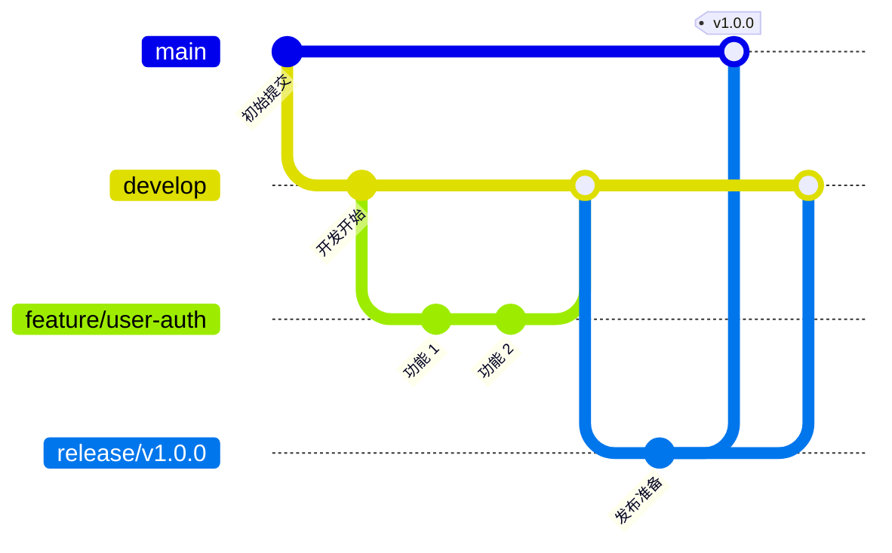

# XCAGI 项目开发规范指南

## 目录

- [1. 代码风格规范](#1-代码风格规范)
  - [1.1 Python 代码规范](#11-python-代码规范)
  - [1.2 Vue 组件规范](#12-vue-组件规范)
  - [1.3 CSS/SCSS 规范](#13-cssscss-规范)
  - [1.4 JavaScript/TypeScript 规范](#14-javascripttypescript-规范)
- [2. 命名规范](#2-命名规范)
  - [2.1 变量命名](#21-变量命名)
  - [2.2 函数命名](#22-函数命名)
  - [2.3 类命名](#23-类命名)
  - [2.4 文件命名](#24-文件命名)
  - [2.5 组件命名](#25-组件命名)
- [3. Git 规范](#3-git-规范)
  - [3.1 分支策略](#31-分支策略)
  - [3.2 Commit Message 格式](#32-commit-message-格式)
  - [3.3 Code Review 流程](#33-code-review-流程)
  - [3.4 版本发布流程](#34-版本发布流程)
- [4. 测试规范](#4-测试规范)
  - [4.1 单元测试](#41-单元测试)
  - [4.2 集成测试](#42-集成测试)
  - [4.3 端到端测试](#43-端到端测试)
  - [4.4 覆盖率目标](#44-覆盖率目标)
  - [4.5 测试数据管理](#45-测试数据管理)
- [5. 日志规范](#5-日志规范)
  - [5.1 日志级别](#51-日志级别)
  - [5.2 日志格式](#52-日志格式)
  - [5.3 日志管理](#53-日志管理)
  - [5.4 日志分析](#54-日志分析)
- [6. API 设计规范](#6-api-设计规范)
  - [6.1 RESTful 设计原则](#61-restful-设计原则)
  - [6.2 错误处理规范](#62-错误处理规范)
  - [6.3 Swagger/OpenAPI 文档](#63-swaggeropenapi-文档)
  - [6.4 接口版本管理](#64-接口版本管理)
  - [6.5 认证与授权](#65-认证与授权)
- [7. 性能优化指南](#7-性能优化指南)
  - [7.1 数据库优化](#71-数据库优化)
  - [7.2 缓存策略](#72-缓存策略)
  - [7.3 前端性能优化](#73-前端性能优化)
  - [7.4 后端性能优化](#74-后端性能优化)
  - [7.5 网络传输优化](#75-网络传输优化)
- [8. 安全规范](#8-安全规范)
  - [8.1 输入验证](#81-输入验证)
  - [8.2 身份认证](#82-身份认证)
  - [8.3 数据加密](#83-数据加密)
  - [8.4 安全审计](#84-安全审计)
- [9. 开发环境配置](#9-开发环境配置)
  - [9.1 开发工具](#91-开发工具)
  - [9.2 环境依赖](#92-环境依赖)
  - [9.3 代码编辑器配置](#93-代码编辑器配置)

---

## 1. 代码风格规范

### 1.1 Python 代码规范

本项目 Python 代码遵循 [PEP 8](https://pep8.org/) 编码规范，并结合项目实际情况制定以下补充规范。

#### 1.1.1 基本规范

- **缩进**: 使用 4 个空格作为一个缩进层级，禁止使用 Tab
- **行长度**: 每行代码最大长度为 100 字符
- **空行**: 
  - 顶层函数和类定义之间使用 2 个空行
  - 方法之间使用 1 个空行
  - 函数内逻辑段落之间可使用 1 个空行分隔

```python
# 正确示例
class UserService:
    """用户服务类"""
    
    def __init__(self, db_session):
        self.db_session = db_session
    
    def get_user_by_id(self, user_id):
        """根据 ID 获取用户"""
        return self.db_session.query(User).filter(User.id == user_id).first()
    
    def create_user(self, user_data):
        """创建新用户"""
        user = User(**user_data)
        self.db_session.add(user)
        self.db_session.commit()
        return user


def process_data(data):
    """处理数据"""
    result = []
    for item in data:
        if item.is_valid:
            result.append(item.transform())
    return result
```

#### 1.1.2 导入规范

- 导入语句按顺序分组：标准库、第三方库、本地模块
- 每组之间使用一个空行分隔
- 使用绝对导入，避免相对导入（测试文件除外）

```python
# 正确示例
import os
import sys
from datetime import datetime

from flask import Flask, request, jsonify
from sqlalchemy import create_engine

from models.user import User
from services.base_service import BaseService
from utils.logger import get_logger
```

#### 1.1.3 注释规范

- 使用中文编写注释
- 公共 API 必须编写文档字符串（docstring）
- 复杂逻辑需要添加行内注释说明

```python
# 正确示例
def calculate_shipping_fee(weight, distance, express_type):
    """
    计算快递费用
    
    Args:
        weight (float): 包裹重量（kg）
        distance (float): 运输距离（km）
        express_type (str): 快递类型（standard/express/premium）
    
    Returns:
        float: 计算得出的快递费用
    
    Raises:
        ValueError: 当参数无效时抛出
    """
    # 基础费率表
    base_rates = {
        'standard': 5.0,
        'express': 8.0,
        'premium': 12.0
    }
    
    # 重量系数计算
    weight_factor = 1.0 + (weight - 1) * 0.5 if weight > 1 else 1.0
    
    # 距离系数计算
    distance_factor = 1.0 + (distance / 1000) * 0.1
    
    return base_rates[express_type] * weight_factor * distance_factor
```

#### 1.1.4 类型提示

- 所有函数参数和返回值必须添加类型提示
- 使用 `typing` 模块处理复杂类型

```python
# 正确示例
from typing import List, Dict, Optional, Union

def get_user_orders(
    user_id: int,
    status: Optional[str] = None,
    limit: int = 10
) -> List[Dict[str, Union[str, int, float]]]:
    """获取用户订单列表"""
    pass

def process_payment(
    amount: float,
    payment_method: str,
    user_id: Optional[int] = None
) -> Dict[str, any]:
    """处理支付"""
    pass
```

#### 1.1.5 异常处理

- 使用具体的异常类型，避免裸 `except`
- 自定义异常类继承自 `Exception`
- 异常信息应清晰描述问题原因

```python
# 正确示例
class BusinessError(Exception):
    """业务逻辑异常基类"""
    pass

class InsufficientStockError(BusinessError):
    """库存不足异常"""
    
    def __init__(self, product_id: int, available: int, requested: int):
        self.product_id = product_id
        self.available = available
        self.requested = requested
        super().__init__(
            f"商品 {product_id} 库存不足：可用 {available}, 请求 {requested}"
        )

def deduct_stock(product_id: int, quantity: int):
    """扣减库存"""
    product = get_product(product_id)
    if product.stock < quantity:
        raise InsufficientStockError(product_id, product.stock, quantity)
    product.stock -= quantity
```

### 1.2 Vue 组件规范

#### 1.2.1 组件文件结构

Vue 单文件组件（SFC）遵循以下顺序：

```vue
<template>
  <!-- 模板内容 -->
</template>

<script setup>
// 脚本内容
</script>

<style scoped>
/* 样式内容 */
</style>
```

#### 1.2.2 组件命名规范

- 组件文件名使用 PascalCase（大驼峰）
- 组件名使用 PascalCase，多单词组成
- 基础组件以 `Base` 或 `App` 前缀开头

```
// 正确示例
✅ ProductList.vue
✅ ProductDetail.vue
✅ BaseButton.vue
✅ AppHeader.vue
✅ UserAvatar.vue

// 错误示例
❌ productlist.vue
❌ Product.vue (单单词名)
❌ user-avatar.vue
```

#### 1.2.3 Props 定义规范

- 使用 `defineProps` 宏定义 props
- 所有 props 必须指定类型
- 对象/数组类型必须指定默认值

```vue
<script setup>
import { computed } from 'vue'

const props = defineProps({
  // 基础类型
  userId: {
    type: Number,
    required: true
  },
  
  // 字符串带默认值
  userName: {
    type: String,
    default: '匿名用户'
  },
  
  // 数组类型
  tags: {
    type: Array,
    default: () => []
  },
  
  // 对象类型
  config: {
    type: Object,
    default: () => ({
      showAvatar: true,
      showBadge: false
    })
  },
  
  // 枚举类型
  status: {
    type: String,
    validator: (value) => ['active', 'inactive', 'pending'].includes(value)
  }
})

// 使用计算属性处理 props
const displayName = computed(() => {
  return props.userName || `用户${props.userId}`
})
</script>
```

#### 1.2.4 事件命名规范

- 事件名使用 kebab-case（短横线分隔）
- 自定义事件以 `update:` 前缀表示双向绑定
- 事件处理函数使用 `handle` 或 `on` 前缀

```vue
<template>
  <div>
    <BaseButton @click="handleClick" />
    <ProductForm 
      @update:model-value="handleUpdate"
      @submit-success="handleSubmitSuccess"
      @validation-error="handleValidationError"
    />
  </div>
</template>

<script setup>
const emit = defineEmits({
  // 声明事件
  'update:modelValue': (value) => true,
  'submit-success': (payload) => true,
  'validation-error': (errors) => true
})

const handleClick = () => {
  emit('update:modelValue', newValue)
}

const handleSubmitSuccess = (data) => {
  emit('submit-success', data)
}
</script>
```

#### 1.2.5 组合式 API 规范

- 优先使用 `<script setup>` 语法
- 相关逻辑使用 Composables 组织
- 响应式数据声明在函数顶部

```vue
<script setup>
import { ref, computed, watch, onMounted } from 'vue'
import { useProductStore } from '@/stores/product'
import { useNotification } from '@/composables/useNotification'

// Props 和 Emits
const props = defineProps({ productId: Number })
const emit = defineEmits(['updated'])

// 响应式状态
const loading = ref(false)
const error = ref(null)
const product = ref(null)

// Store 和 Composables
const productStore = useProductStore()
const { showSuccess, showError } = useNotification()

// 计算属性
const productTitle = computed(() => product.value?.title || '未命名商品')
const isValid = computed(() => product.value?.status === 'active')

// 方法
const fetchProduct = async () => {
  loading.value = true
  error.value = null
  try {
    product.value = await productStore.getById(props.productId)
  } catch (err) {
    error.value = err.message
    showError('加载商品失败')
  } finally {
    loading.value = false
  }
}

const handleUpdate = async (data) => {
  await productStore.update(props.productId, data)
  showSuccess('更新成功')
  emit('updated')
}

// 生命周期
onMounted(() => {
  fetchProduct()
})

// 监听器
watch(
  () => props.productId,
  (newId) => {
    if (newId) fetchProduct()
  }
)
</script>
```

#### 1.2.6 模板规范

- 使用语义化 HTML 标签
- `v-if` 和 `v-for` 不同时使用
- 为 `v-for` 添加 key，不使用 index

```vue
<template>
  <!-- 正确示例 -->
  <article class="product-card">
    <header class="product-header">
      <h3 class="product-title">{{ product.title }}</h3>
      <span v-if="product.isNew" class="badge">新品</span>
    </header>
    
    <figure class="product-image">
      
    </figure>
    
    <ul class="product-features">
      <li 
        v-for="feature in product.features" 
        :key="feature.id"
        class="feature-item"
      >
        {{ feature.name }}
      </li>
    </ul>
    
    <footer class="product-footer">
      <BaseButton 
        :disabled="!product.inStock"
        @click="handleAddToCart"
      >
        加入购物车
      </BaseButton>
    </footer>
  </article>
  
  <!-- 错误示例：v-if 和 v-for 同时使用 -->
  <div 
    v-for="item in items" 
    v-if="item.visible"
    :key="item.id"
  />
</template>
```

### 1.3 CSS/SCSS 规范

#### 1.3.1 样式组织

- 使用 BEM 命名规范（Block__Element--Modifier）
- 使用 SCSS 预处理器
- 组件样式使用 `scoped`

```scss
// 正确示例
.product-card {
  display: flex;
  flex-direction: column;
  border-radius: 8px;
  box-shadow: 0 2px 8px rgba(0, 0, 0, 0.1);
  
  &__header {
    padding: 16px;
    border-bottom: 1px solid #e0e0e0;
    
    &--highlighted {
      background-color: #ff6b6b;
    }
  }
  
  &__title {
    font-size: 18px;
    font-weight: 600;
    color: #333;
  }
  
  &__body {
    flex: 1;
    padding: 16px;
  }
  
  &__image {
    width: 100%;
    height: 200px;
    object-fit: cover;
  }
  
  &--compact {
    padding: 8px;
    
    .product-card__title {
      font-size: 14px;
    }
  }
}
```

#### 1.3.2 属性顺序

按照以下顺序组织 CSS 属性：

1. 定位（position, top, left, z-index）
2. 盒模型（display, width, height, margin, padding）
3. 排版（font, color, text-align）
4. 外观（background, border, box-shadow）
5. 其他

```scss
// 正确示例
.button {
  // 定位
  position: relative;
  z-index: 10;
  
  // 盒模型
  display: inline-flex;
  width: auto;
  padding: 12px 24px;
  margin: 8px;
  
  // 排版
  font-size: 14px;
  font-weight: 500;
  color: #fff;
  text-align: center;
  
  // 外观
  background-color: #4CAF50;
  border: none;
  border-radius: 4px;
  box-shadow: 0 2px 4px rgba(0, 0, 0, 0.2);
  
  // 其他
  cursor: pointer;
  transition: all 0.3s ease;
}
```

### 1.4 JavaScript/TypeScript 规范

#### 1.4.1 变量声明

- 使用 `const` 声明常量
- 使用 `let` 声明可变量
- 禁止使用 `var`

```typescript
// 正确示例
const MAX_RETRY_COUNT = 3
let retryCount = 0

const config = {
  apiUrl: '/api',
  timeout: 5000
}

// 错误示例
var count = 0  // ❌ 禁止使用 var
```

#### 1.4.2 箭头函数

- 简单函数优先使用箭头函数
- 对象方法使用简写语法

```typescript
// 正确示例
const numbers = [1, 2, 3, 4, 5]

// 箭头函数
const doubled = numbers.map(n => n * 2)

// 多参数加括号
const sum = numbers.reduce((acc, curr) => acc + curr, 0)

// 多行使用大括号
const processUser = (user) => {
  if (!user.isValid) {
    return null
  }
  return transformUser(user)
}

// 对象方法简写
const utils = {
  formatDate(date) {
    return date.toISOString()
  },
  
  parseDate(str) {
    return new Date(str)
  }
}
```

---

## 2. 命名规范

### 2.1 变量命名

#### 2.1.1 命名风格

- **Python**: 使用 snake_case（小写 + 下划线）
- **JavaScript/TypeScript**: 使用 camelCase（小驼峰）
- **常量**: 全部使用 UPPER_SNAKE_CASE

```python
# Python 示例
user_name = "张三"
order_total_amount = 100.00
MAX_CONNECTIONS = 100
API_BASE_URL = "https://api.example.com"
```

```typescript
// TypeScript 示例
const userName = '张三'
const orderTotalAmount = 100.00
const MAX_CONNECTIONS = 100
const API_BASE_URL = 'https://api.example.com'
```

#### 2.1.2 语义化命名

变量名应清晰表达其用途，避免使用模糊的缩写。

```python
# 正确示例
user_list = []
product_inventory = {}
order_creation_timestamp = datetime.now()
customer_email_address = "user@example.com"

# 错误示例
ul = []  # ❌ 含义不明
pi = {}  # ❌ 容易与圆周率混淆
ts = datetime.now()  # ❌ 不够明确
email = "user@example.com"  # ❌ 缺少上下文
```

#### 2.1.3 布尔值命名

布尔变量使用助动词或形容词前缀。

```python
# 推荐的前缀
is_active = True
has_permission = False
can_edit = True
should_update = False
was_deleted = True
```

### 2.2 函数命名

#### 2.2.1 动词 + 宾语结构

函数名应清晰描述其执行的操作。

```python
# 正确示例
def get_user_by_id(user_id):
    pass

def create_new_user(user_data):
    pass

def update_user_profile(user_id, profile_data):
    pass

def delete_user_account(user_id):
    pass

def calculate_shipping_cost(weight, distance):
    pass

def validate_user_input(data):
    pass
```

#### 2.2.2 返回值相关的命名

- 返回布尔值的函数使用 `is/has/can/should` 前缀
- 返回转换结果的函数使用 `to/as` 前缀

```python
def is_valid_email(email):
    """验证邮箱格式"""
    pass

def has_active_subscription(user_id):
    """检查是否有活跃订阅"""
    pass

def to_user_dict(user):
    """将用户对象转换为字典"""
    pass

def as_json_response(data):
    """将数据转换为 JSON 响应格式"""
    pass
```

### 2.3 类命名

#### 2.3.1 类名使用 PascalCase

```python
# 正确示例
class UserService:
    pass

class ProductController:
    pass

class DatabaseConnection:
    pass

class OrderItem:
    pass

# 错误示例
class user_service:  # ❌ 使用了 snake_case
class PRODUCT:  # ❌ 全大写
```

#### 2.3.2 类名应为名词

类名应使用名词，表示具体的事物或概念。

```python
# 正确示例
class User:
    pass

class Order:
    pass

class ShoppingCart:
    pass

class PaymentProcessor:
    pass

class EmailSender:
    pass
```

### 2.4 文件命名

#### 2.4.1 Python 文件

- 模块文件：snake_case
- 测试文件：`test_<module>.py`

```
# 正确示例
user_service.py
product_controller.py
database_connection.py
test_user_service.py
test_product_controller.py
```

#### 2.4.2 Vue 组件文件

- 组件文件：PascalCase
- 组合式函数：useXxx.ts

```
# 正确示例
ProductList.vue
ProductDetail.vue
BaseButton.vue
useProduct.ts
useNotification.ts
```

#### 2.4.3 配置文件

- 配置文件使用项目标准命名

```
# 正确示例
package.json
requirements.txt
pyproject.toml
vite.config.js
tsconfig.json
```

### 2.5 组件命名

#### 2.5.1 组件注册名

```vue
<!-- 正确示例 -->
<script setup>
// 文件名：ProductList.vue
defineOptions({
  name: 'ProductList'
})
</script>
```

#### 2.5.2 多单词组件名

组件名应由多个单词组成，避免与 HTML 标签冲突。

```
✅ TodoItem
✅ UserProfile
✅ ProductCard
✅ OrderHistory

❌ Item (与 HTML <item> 冲突)
❌ Card (含义不明确)
```

---

## 3. Git 规范

### 3.1 分支策略

#### 3.1.1 分支模型

本项目采用 Git Flow 分支模型：



#### 3.1.2 分支命名

| 分支类型 | 命名格式 | 说明 |
|---------|---------|------|
| 主分支 | `main` | 生产环境代码，随时可部署 |
| 开发分支 | `develop` | 开发环境主分支 |
| 功能分支 | `feature/<功能名>` | 新功能开发 |
| 修复分支 | `fix/<问题名>` | Bug 修复 |
| 发布分支 | `release/v<版本号>` | 发布准备 |
| 热修复分支 | `hotfix/<问题名>` | 生产环境紧急修复 |

#### 3.1.3 分支使用规则

```bash
# 创建功能分支
git checkout develop
git checkout -b feature/user-login

# 创建修复分支
git checkout develop
git checkout -b fix/order-calculation-error

# 创建发布分支
git checkout develop
git checkout -b release/v1.2.0

# 创建热修复分支
git checkout main
git checkout -b hotfix/critical-security-issue
```

### 3.2 Commit Message 格式

#### 3.2.1 提交格式

遵循 Conventional Commits 规范：

```
<type>(<scope>): <subject>

<body>

<footer>
```

#### 3.2.2 Type 类型

| 类型 | 说明 |
|------|------|
| feat | 新功能 |
| fix | Bug 修复 |
| docs | 文档更新 |
| style | 代码格式调整（不影响代码运行） |
| refactor | 代码重构（既不是新功能也不是修复） |
| perf | 性能优化 |
| test | 测试相关 |
| chore | 构建过程或辅助工具变动 |
| ci | CI 配置变更 |
| build | 构建系统或外部依赖变更 |

#### 3.2.3 提交消息示例

```bash
# 新功能
git commit -m "feat(user): 添加用户注册功能

- 实现用户注册 API
- 添加邮箱验证逻辑
- 创建欢迎邮件发送任务

Closes #123"

# Bug 修复
git commit -m "fix(order): 修复订单金额计算错误

当订单包含折扣券时，总金额计算未正确应用折扣。

修复内容：
- 修正 calculate_total 函数逻辑
- 添加折扣计算单元测试

Fixes #456"

# 文档更新
git commit -m "docs: 更新 API 文档

- 补充用户模块 API 说明
- 添加请求示例"

# 重构
git commit -m "refactor(product): 重构商品服务层

- 提取公共逻辑到基类
- 优化数据库查询性能
- 改进错误处理"
```

#### 3.2.4 提交规范检查

使用 commitlint 进行提交消息检查：

```json
// .commitlintrc.json
{
  "extends": ["@commitlint/config-conventional"],
  "rules": {
    "type-enum": [2, "always", [
      "feat", "fix", "docs", "style", "refactor",
      "perf", "test", "chore", "ci", "build"
    ]],
    "subject-max-length": [2, "always", 100],
    "body-max-line-length": [2, "always", 100]
  }
}
```

### 3.3 Code Review 流程

#### 3.3.1 Pull Request 规范

1. **PR 标题**: 遵循 Commit Message 格式
2. **PR 描述**: 包含变更说明、测试情况、相关 Issue
3. **审查者**: 至少需要 1 名核心开发者审查
4. **CI 检查**: 所有 CI 检查必须通过

#### 3.3.2 PR 模板

```markdown
## 变更说明
<!-- 描述本次变更的主要内容 -->

## 相关 Issue
<!-- 关联的 Issue 编号 -->
Closes #

## 测试情况
<!-- 说明测试覆盖情况 -->
- [ ] 单元测试已通过
- [ ] 集成测试已通过
- [ ] 手动测试已完成

## 截图/录屏
<!-- 如有 UI 变更，提供截图或录屏 -->

## 检查清单
- [ ] 代码遵循项目规范
- [ ] 已添加必要的注释
- [ ] 已更新相关文档
- [ ] 无敏感信息泄露
```

#### 3.3.3 Code Review 检查项

- [ ] 代码功能是否正确
- [ ] 是否有适当的测试覆盖
- [ ] 是否遵循代码规范
- [ ] 是否有性能问题
- [ ] 是否有安全隐患
- [ ] 是否有适当的错误处理
- [ ] 代码是否可读、可维护

### 3.4 版本发布流程

#### 3.4.1 版本号规则

遵循语义化版本（Semantic Versioning）：

```
主版本号。次版本号。修订号
MAJOR.MINOR.PATCH
```

- **MAJOR**: 不兼容的 API 变更
- **MINOR**: 向后兼容的功能性新增
- **PATCH**: 向后兼容的问题修正

#### 3.4.2 发布流程

```bash
# 1. 创建发布分支
git checkout -b release/v1.2.0

# 2. 更新版本号
# 更新 pyproject.toml、package.json 等

# 3. 更新 CHANGELOG.md
# 记录本次变更内容

# 4. 测试验证
npm run test
pytest

# 5. 合并到 main 和 develop
git checkout main
git merge release/v1.2.0
git tag -a v1.2.0 -m "Release v1.2.0"

git checkout develop
git merge release/v1.2.0

# 6. 删除发布分支
git branch -d release/v1.2.0

# 7. 推送标签
git push origin v1.2.0
```

---

## 4. 测试规范

### 4.1 单元测试

#### 4.1.1 测试框架

- **Python**: pytest
- **Vue/JavaScript**: Vitest

#### 4.1.2 测试文件组织

```
tests/
├── unit/
│   ├── python/
│   │   ├── test_user_service.py
│   │   ├── test_product_service.py
│   │   └── test_order_service.py
│   └── frontend/
│       ├── components/
│       │   ├── ProductList.spec.js
│       │   └── UserForm.spec.js
│       ├── composables/
│       │   └── useProduct.spec.js
│       └── utils/
│           └── formatters.spec.js
├── integration/
│   ├── test_api_endpoints.py
│   └── test_database_operations.py
└── e2e/
    └── test_user_flow.spec.js
```

#### 4.1.3 测试编写规范

```python
# Python 测试示例
import pytest
from unittest.mock import Mock, patch
from services.user_service import UserService
from models.user import User

class TestUserService:
    """用户服务测试类"""
    
    @pytest.fixture
    def mock_db_session(self):
        """模拟数据库会话"""
        return Mock()
    
    @pytest.fixture
    def user_service(self, mock_db_session):
        """用户服务实例"""
        return UserService(mock_db_session)
    
    def test_get_user_by_id_success(self, user_service, mock_db_session):
        """测试成功获取用户"""
        # Arrange
        expected_user = User(id=1, name='张三', email='zhangsan@example.com')
        mock_db_session.query.return_value.filter.return_value.first.return_value = expected_user
        
        # Act
        result = user_service.get_user_by_id(1)
        
        # Assert
        assert result == expected_user
        assert result.name == '张三'
        assert result.email == 'zhangsan@example.com'
    
    def test_get_user_by_id_not_found(self, user_service, mock_db_session):
        """测试用户不存在的情况"""
        # Arrange
        mock_db_session.query.return_value.filter.return_value.first.return_value = None
        
        # Act & Assert
        with pytest.raises(ValueError) as exc_info:
            user_service.get_user_by_id(999)
        assert '用户不存在' in str(exc_info.value)
    
    def test_create_user(self, user_service, mock_db_session):
        """测试创建用户"""
        # Arrange
        user_data = {
            'name': '李四',
            'email': 'lisi@example.com',
            'password': 'secure_password'
        }
        
        # Act
        result = user_service.create_user(user_data)
        
        # Assert
        assert result.name == '李四'
        assert result.email == 'lisi@example.com'
        mock_db_session.add.assert_called_once()
        mock_db_session.commit.assert_called_once()
```

```javascript
// Vue 组件测试示例
import { describe, it, expect, vi } from 'vitest'
import { mount } from '@vue/test-utils'
import ProductList from '@/components/ProductList.vue'

describe('ProductList', () => {
  const mockProducts = [
    { id: 1, name: '商品 1', price: 100, inStock: true },
    { id: 2, name: '商品 2', price: 200, inStock: false }
  ]
  
  it('渲染商品列表', () => {
    const wrapper = mount(ProductList, {
      props: { products: mockProducts }
    })
    
    expect(wrapper.findAll('.product-item').length).toBe(2)
    expect(wrapper.text()).toContain('商品 1')
    expect(wrapper.text()).toContain('商品 2')
  })
  
  it('缺货商品显示缺货标签', () => {
    const wrapper = mount(ProductList, {
      props: { products: mockProducts }
    })
    
    const outOfStockLabels = wrapper.findAll('.out-of-stock-label')
    expect(outOfStockLabels.length).toBe(1)
  })
  
  it('点击商品触发事件', async () => {
    const wrapper = mount(ProductList, {
      props: { products: mockProducts }
    })
    
    await wrapper.find('.product-item').trigger('click')
    
    expect(wrapper.emitted('product-click')).toBeTruthy()
    expect(wrapper.emitted('product-click')[0]).toEqual([mockProducts[0]])
  })
})
```

#### 4.1.4 测试命名规范

```python
# 测试函数命名格式：test_<被测函数>_<场景>_<预期结果>
def test_calculate_total_with_discount_should_apply_discount():
    pass

def test_create_user_with_invalid_email_should_raise_error():
    pass

def test_get_user_by_id_when_not_found_should_return_none():
    pass
```

### 4.2 集成测试

#### 4.2.1 API 集成测试

```python
# tests/integration/test_api_endpoints.py
import pytest
from fastapi.testclient import TestClient
from main import app

client = TestClient(app)

class TestUserAPI:
    """用户 API 集成测试"""
    
    def test_register_user_success(self):
        """测试用户注册成功"""
        payload = {
            'username': 'testuser',
            'email': 'test@example.com',
            'password': 'securepass123'
        }
        
        response = client.post('/api/v1/users/register', json=payload)
        
        assert response.status_code == 201
        data = response.json()
        assert data['username'] == 'testuser'
        assert 'id' in data
        assert 'password' not in data
    
    def test_get_user_profile_authenticated(self, auth_client):
        """测试已认证用户获取个人资料"""
        response = auth_client.get('/api/v1/users/profile')
        
        assert response.status_code == 200
        assert response.json()['email'] == 'test@example.com'
    
    def test_get_user_profile_unauthenticated(self):
        """测试未认证用户获取个人资料"""
        response = client.get('/api/v1/users/profile')
        
        assert response.status_code == 401
    
    @pytest.fixture
    def auth_client(self):
        """已认证的测试客户端"""
        # 先登录获取 token
        login_response = client.post('/api/v1/auth/login', json={
            'email': 'test@example.com',
            'password': 'securepass123'
        })
        token = login_response.json()['access_token']
        
        # 创建带认证的客户端
        client.headers['Authorization'] = f'Bearer {token}'
        return client
```

### 4.3 端到端测试

#### 4.3.1 E2E 测试配置

使用 Playwright 进行 E2E 测试：

```javascript
// tests/e2e/test_user_flow.spec.js
import { test, expect } from '@playwright/test'

test.describe('用户流程', () => {
  test('完整的用户注册到下单流程', async ({ page }) => {
    // 1. 访问首页
    await page.goto('http://localhost:3000')
    await expect(page).toHaveTitle(/XCAGI/)
    
    // 2. 点击注册按钮
    await page.click('[data-testid="register-btn"]')
    await expect(page).toHaveURL('/register')
    
    // 3. 填写注册表单
    await page.fill('[name="username"]', 'testuser')
    await page.fill('[name="email"]', 'test@example.com')
    await page.fill('[name="password"]', 'securepass123')
    await page.click('[type="submit"]')
    
    // 4. 验证注册成功
    await expect(page.locator('.welcome-message')).toBeVisible()
    
    // 5. 浏览商品
    await page.click('[data-testid="products-link"]')
    await page.waitForSelector('.product-item')
    
    // 6. 添加商品到购物车
    const firstProduct = page.locator('.product-item').first()
    await firstProduct.click()
    await page.click('[data-testid="add-to-cart-btn"]')
    
    // 7. 验证购物车
    await page.click('[data-testid="cart-icon"]')
    await expect(page.locator('.cart-item')).toHaveCount(1)
    
    // 8. 结算下单
    await page.click('[data-testid="checkout-btn"]')
    await page.waitForURL('/order/confirmation')
    await expect(page.locator('.order-success')).toBeVisible()
  })
})
```

### 4.4 覆盖率目标

#### 4.4.1 覆盖率要求

| 模块类型 | 行覆盖率 | 分支覆盖率 | 函数覆盖率 |
|---------|---------|-----------|-----------|
| 核心业务逻辑 | ≥ 90% | ≥ 85% | ≥ 95% |
| 服务层 | ≥ 85% | ≥ 80% | ≥ 90% |
| API 接口 | ≥ 80% | ≥ 75% | ≥ 90% |
| 工具函数 | ≥ 95% | ≥ 90% | ≥ 100% |
| 前端组件 | ≥ 80% | ≥ 75% | ≥ 85% |
| **整体目标** | **≥ 80%** | **≥ 75%** | **≥ 85%** |

#### 4.4.2 覆盖率配置

```ini
# pytest.ini
[pytest]
addopts = 
    --cov=src
    --cov-report=html
    --cov-report=xml
    --cov-report=term-missing
    --cov-fail-under=80

# .nycrc (前端)
{
  "extends": "@istanbuljs/nyc-config-typescript",
  "all": true,
  "include": ["src/**/*.ts", "src/**/*.vue"],
  "exclude": ["src/**/*.spec.ts"],
  "check-coverage": true,
  "lines": 80,
  "functions": 85,
  "branches": 75,
  "statements": 80
}
```

#### 4.4.3 覆盖率报告

```bash
# 生成覆盖率报告
pytest --cov=src --cov-report=html
# 查看覆盖率
coverage report --fail-under=80
# 生成 XML 报告（用于 CI）
coverage xml
```

### 4.5 测试数据管理

#### 4.5.1 测试夹具（Fixtures）

```python
# tests/conftest.py
import pytest
from sqlalchemy import create_engine
from sqlalchemy.orm import sessionmaker
from models.base import Base
from models.user import User
from models.product import Product

@pytest.fixture(scope='session')
def test_engine():
    """创建测试数据库引擎"""
    engine = create_engine('sqlite:///:memory:')
    Base.metadata.create_all(engine)
    return engine

@pytest.fixture
def db_session(test_engine):
    """创建测试数据库会话"""
    Session = sessionmaker(bind=test_engine)
    session = Session()
    yield session
    session.rollback()
    session.close()

@pytest.fixture
def sample_user(db_session):
    """创建示例用户"""
    user = User(
        username='testuser',
        email='test@example.com',
        password_hash='hashed_password'
    )
    db_session.add(user)
    db_session.commit()
    return user

@pytest.fixture
def sample_products(db_session):
    """创建示例商品"""
    products = [
        Product(name='商品 1', price=100, stock=10),
        Product(name='商品 2', price=200, stock=20),
        Product(name='商品 3', price=300, stock=30)
    ]
    for product in products:
        db_session.add(product)
    db_session.commit()
    return products
```

#### 4.5.2 测试数据工厂

```python
# tests/factories.py
from factory import Factory, Faker, Sequence
from models.user import User
from models.product import Product
from models.order import Order

class UserFactory(Factory):
    class Meta:
        model = User
    
    username = Sequence(lambda n: f'user{n}')
    email = Faker('email')
    password_hash = 'default_hash'

class ProductFactory(Factory):
    class Meta:
        model = Product
    
    name = Faker('name')
    price = Faker('pyfloat', left_digits=2, right_digits=2, positive=True)
    stock = Faker('random_int', min=0, max=100)

class OrderFactory(Factory):
    class Meta:
        model = Order
    
    user = factory.SubFactory(UserFactory)
    total_amount = Faker('pyfloat', left_digits=3, right_digits=2, positive=True)
    status = 'pending'
```

---

## 5. 日志规范

### 5.1 日志级别

#### 5.1.1 日志级别定义

| 级别 | 说明 | 使用场景 |
|------|------|---------|
| DEBUG | 调试信息 | 开发调试时的详细信息 |
| INFO | 一般信息 | 系统正常运行状态 |
| WARNING | 警告信息 | 潜在问题，不影响运行 |
| ERROR | 错误信息 | 错误发生，影响部分功能 |
| CRITICAL | 严重错误 | 系统无法继续运行 |

#### 5.1.2 日志级别使用规范

```python
import logging

logger = logging.getLogger(__name__)

# DEBUG - 详细的调试信息
logger.debug(f"处理用户数据：user_id={user_id}, data={data}")

# INFO - 重要的运行时信息
logger.info(f"用户登录成功：user_id={user_id}, ip={client_ip}")

# WARNING - 警告信息
logger.warning(f"API 调用频率接近限制：user_id={user_id}, count={count}")

# ERROR - 错误信息
logger.error(f"数据库查询失败：error={str(e)}", exc_info=True)

# CRITICAL - 严重错误
logger.critical(f"系统资源耗尽：memory={memory_usage}", exc_info=True)
```

### 5.2 日志格式

#### 5.2.1 日志格式配置

```python
# utils/logger.py
import logging
import sys
from datetime import datetime

def get_logger(name: str) -> logging.Logger:
    """获取日志器实例"""
    logger = logging.getLogger(name)
    logger.setLevel(logging.DEBUG)
    
    # 避免重复添加处理器
    if logger.handlers:
        return logger
    
    # 控制台处理器
    console_handler = logging.StreamHandler(sys.stdout)
    console_handler.setLevel(logging.INFO)
    console_formatter = logging.Formatter(
        fmt='%(asctime)s [%(levelname)s] %(name)s: %(message)s',
        datefmt='%Y-%m-%d %H:%M:%S'
    )
    console_handler.setFormatter(console_formatter)
    logger.addHandler(console_handler)
    
    # 文件处理器
    file_handler = logging.FileHandler(
        f'logs/{name}_{datetime.now().strftime("%Y%m%d")}.log',
        encoding='utf-8'
    )
    file_handler.setLevel(logging.DEBUG)
    file_formatter = logging.Formatter(
        fmt='%(asctime)s [%(levelname)s] %(name)s '
            '[%(filename)s:%(lineno)d] %(funcName)s: %(message)s',
        datefmt='%Y-%m-%d %H:%M:%S'
    )
    file_handler.setFormatter(file_formatter)
    logger.addHandler(file_handler)
    
    return logger
```

#### 5.2.2 日志输出示例

```
2024-01-15 10:30:45 [INFO] user_service: 用户登录成功：user_id=123
2024-01-15 10:30:46 [DEBUG] order_service: 创建订单：order_id=456, amount=299.00
2024-01-15 10:30:47 [WARNING] payment_service: 支付超时重试：attempt=2
2024-01-15 10:30:48 [ERROR] database: 查询失败 [database.py:125] execute_query: Connection timeout
2024-01-15 10:30:49 [CRITICAL] main: 系统启动失败 [main.py:45] start_server: Port already in use
```

### 5.3 日志管理

#### 5.3.1 日志轮转

```python
# utils/logger.py
from logging.handlers import RotatingFileHandler, TimedRotatingFileHandler

def setup_rotating_logger(name: str) -> logging.Logger:
    """设置轮转日志处理器"""
    logger = logging.getLogger(name)
    logger.setLevel(logging.DEBUG)
    
    # 按大小轮转（100MB）
    size_handler = RotatingFileHandler(
        f'logs/{name}.log',
        maxBytes=100 * 1024 * 1024,  # 100MB
        backupCount=10,
        encoding='utf-8'
    )
    
    # 按时间轮转（每天）
    time_handler = TimedRotatingFileHandler(
        f'logs/{name}_time.log',
        when='D',
        interval=1,
        backupCount=30,
        encoding='utf-8'
    )
    
    logger.addHandler(size_handler)
    logger.addHandler(time_handler)
    
    return logger
```

#### 5.3.2 日志清理策略

```bash
#!/bin/bash
# scripts/cleanup_logs.sh

# 清理 30 天前的日志文件
find logs/ -name "*.log" -mtime +30 -delete

# 压缩旧日志
find logs/ -name "*.log" -mtime +7 -exec gzip {} \;

# 清理压缩日志（90 天前）
find logs/ -name "*.log.gz" -mtime +90 -delete
```

### 5.4 日志分析

#### 5.4.1 日志聚合

使用结构化日志便于分析：

```python
import json

class JSONFormatter(logging.Formatter):
    """JSON 格式日志处理器"""
    
    def format(self, record):
        log_data = {
            'timestamp': self.formatTime(record),
            'level': record.levelname,
            'logger': record.name,
            'message': record.getMessage(),
            'module': record.module,
            'function': record.funcName,
            'line': record.lineno
        }
        
        # 添加额外字段
        if hasattr(record, 'user_id'):
            log_data['user_id'] = record.user_id
        if hasattr(record, 'request_id'):
            log_data['request_id'] = record.request_id
        
        # 添加异常信息
        if record.exc_info:
            log_data['exception'] = self.formatException(record.exc_info)
        
        return json.dumps(log_data, ensure_ascii=False)
```

#### 5.4.2 日志监控告警

```python
# utils/log_monitor.py
import re
from collections import Counter

class LogMonitor:
    """日志监控器"""
    
    def __init__(self, log_file: str):
        self.log_file = log_file
        self.error_patterns = {
            'database_error': re.compile(r'数据库.*失败|Database.*error'),
            'authentication_error': re.compile(r'认证失败|Authentication failed'),
            'timeout_error': re.compile(r'超时|Timeout')
        }
    
    def analyze_errors(self, last_n_lines: int = 1000) -> dict:
        """分析最近错误"""
        error_counts = Counter()
        
        with open(self.log_file, 'r', encoding='utf-8') as f:
            lines = f.readlines()[-last_n_lines:]
            
            for line in lines:
                if '[ERROR]' in line or '[CRITICAL]' in line:
                    for pattern_name, pattern in self.error_patterns.items():
                        if pattern.search(line):
                            error_counts[pattern_name] += 1
        
        return dict(error_counts)
    
    def should_alert(self, threshold: int = 10) -> bool:
        """判断是否应该发送告警"""
        errors = self.analyze_errors()
        total_errors = sum(errors.values())
        return total_errors >= threshold
```

---

## 6. API 设计规范

### 6.1 RESTful 设计原则

#### 6.1.1 资源命名

- 使用名词复数形式
- 使用小写字母和连字符
- 避免使用动词

```
# 正确示例
GET    /api/v1/users          # 获取用户列表
GET    /api/v1/users/{id}     # 获取单个用户
POST   /api/v1/users          # 创建用户
PUT    /api/v1/users/{id}     # 更新用户
DELETE /api/v1/users/{id}     # 删除用户

# 错误示例
GET    /api/v1/getUsers       # ❌ 使用动词
GET    /api/v1/user/{id}      # ❌ 使用单数
POST   /api/v1/createUser     # ❌ 使用动词
```

#### 6.1.2 资源嵌套

```
# 获取用户的所有订单
GET /api/v1/users/{userId}/orders

# 获取订单的订单项
GET /api/v1/orders/{orderId}/items

# 创建订单的订单项
POST /api/v1/orders/{orderId}/items
```

#### 6.1.3 HTTP 方法

| 方法 | 说明 | 幂等性 |
|------|------|--------|
| GET | 获取资源 | 是 |
| POST | 创建资源 | 否 |
| PUT | 更新资源（全量） | 是 |
| PATCH | 更新资源（部分） | 是 |
| DELETE | 删除资源 | 是 |

### 6.2 错误处理规范

#### 6.2.1 HTTP 状态码

| 状态码 | 说明 |
|--------|------|
| 200 OK | 请求成功 |
| 201 Created | 资源创建成功 |
| 204 No Content | 删除成功 |
| 400 Bad Request | 请求参数错误 |
| 401 Unauthorized | 未授权 |
| 403 Forbidden | 禁止访问 |
| 404 Not Found | 资源不存在 |
| 409 Conflict | 资源冲突 |
| 422 Unprocessable Entity | 参数验证失败 |
| 429 Too Many Requests | 请求过多 |
| 500 Internal Server Error | 服务器内部错误 |

#### 6.2.2 错误响应格式

```json
{
  "success": false,
  "error": {
    "code": "VALIDATION_ERROR",
    "message": "请求参数验证失败",
    "details": [
      {
        "field": "email",
        "message": "邮箱格式不正确"
      },
      {
        "field": "password",
        "message": "密码长度至少为 8 位"
      }
    ]
  },
  "timestamp": "2024-01-15T10:30:45Z",
  "request_id": "req_123456789"
}
```

#### 6.2.3 错误码定义

```python
# constants/error_codes.py
from enum import Enum

class ErrorCode(Enum):
    """错误码定义"""
    
    # 通用错误 (1000-1999)
    SUCCESS = (200, "操作成功")
    BAD_REQUEST = (400, "请求参数错误")
    UNAUTHORIZED = (401, "未授权访问")
    FORBIDDEN = (403, "禁止访问")
    NOT_FOUND = (404, "资源不存在")
    INTERNAL_ERROR = (500, "服务器内部错误")
    
    # 用户相关错误 (2000-2999)
    USER_NOT_FOUND = (2001, "用户不存在")
    USER_ALREADY_EXISTS = (2002, "用户已存在")
    INVALID_CREDENTIALS = (2003, "用户名或密码错误")
    USER_LOCKED = (2004, "用户账户已锁定")
    
    # 订单相关错误 (3000-3999)
    ORDER_NOT_FOUND = (3001, "订单不存在")
    ORDER_ALREADY_PAID = (3002, "订单已支付")
    INSUFFICIENT_STOCK = (3003, "库存不足")
    
    # 支付相关错误 (4000-4999)
    PAYMENT_FAILED = (4001, "支付失败")
    PAYMENT_TIMEOUT = (4002, "支付超时")
    
    def __init__(self, http_status: int, message: str):
        self.http_status = http_status
        self.message = message
```

### 6.3 Swagger/OpenAPI 文档

#### 6.3.1 API 文档配置

```python
# main.py
from fastapi import FastAPI
from fastapi.middleware.cors import CORSMiddleware

app = FastAPI(
    title="XCAGI API",
    description="XCAGI 系统 RESTful API 文档",
    version="1.0.0",
    docs_url="/api/docs",
    redoc_url="/api/redoc",
    openapi_url="/api/openapi.json"
)

# CORS 配置
app.add_middleware(
    CORSMiddleware,
    allow_origins=["http://localhost:3000"],
    allow_credentials=True,
    allow_methods=["*"],
    allow_headers=["*"],
)
```

#### 6.3.2 API 路由文档

```python
# routes/users.py
from fastapi import APIRouter, HTTPException, status
from pydantic import BaseModel, EmailStr, Field
from typing import List, Optional

router = APIRouter(prefix="/api/v1/users", tags=["用户管理"])

class UserCreate(BaseModel):
    """用户创建请求体"""
    username: str = Field(..., min_length=3, max_length=50, description="用户名")
    email: EmailStr = Field(..., description="邮箱地址")
    password: str = Field(..., min_length=8, description="密码")
    
    class Config:
        schema_extra = {
            "example": {
                "username": "zhangsan",
                "email": "zhangsan@example.com",
                "password": "securepass123"
            }
        }

class UserResponse(BaseModel):
    """用户响应体"""
    id: int
    username: str
    email: str
    is_active: bool
    created_at: str
    
    class Config:
        from_attributes = True

@router.post(
    "",
    response_model=UserResponse,
    status_code=status.HTTP_201_CREATED,
    summary="创建用户",
    description="注册新用户",
    responses={
        201: {"description": "创建成功"},
        400: {"description": "请求参数错误"},
        409: {"description": "用户已存在"}
    }
)
async def create_user(user_data: UserCreate):
    """创建新用户"""
    # 实现逻辑
    pass

@router.get(
    "/{user_id}",
    response_model=UserResponse,
    summary="获取用户信息",
    description="根据 ID 获取用户详细信息"
)
async def get_user(user_id: int):
    """获取用户详情"""
    pass

@router.get(
    "",
    response_model=List[UserResponse],
    summary="获取用户列表",
    description="支持分页和筛选"
)
async def list_users(
    skip: int = 0,
    limit: int = 20,
    is_active: Optional[bool] = None
):
    """获取用户列表"""
    pass
```

#### 6.3.3 Swagger UI 示例

访问 `http://localhost:8000/api/docs` 查看交互式 API 文档。

### 6.4 接口版本管理

#### 6.4.1 URL 版本控制

```
# 版本 1
GET /api/v1/users

# 版本 2（向后兼容）
GET /api/v2/users
```

#### 6.4.2 版本弃用策略

```python
@router.get(
    "/users",
    deprecated=True,
    summary="获取用户列表 (已弃用)",
    description="请使用 /api/v2/users"
)
async def list_users_v1():
    """旧版本用户列表"""
    pass
```

### 6.5 认证与授权

#### 6.5.1 JWT Token 认证

```python
# utils/auth.py
from datetime import datetime, timedelta
from jose import JWTError, jwt

SECRET_KEY = "your-secret-key"
ALGORITHM = "HS256"
ACCESS_TOKEN_EXPIRE_MINUTES = 30

def create_access_token(data: dict, expires_delta: timedelta = None):
    """创建访问令牌"""
    to_encode = data.copy()
    expire = datetime.utcnow() + (expires_delta or timedelta(minutes=15))
    to_encode.update({"exp": expire})
    return jwt.encode(to_encode, SECRET_KEY, algorithm=ALGORITHM)

def verify_token(token: str):
    """验证令牌"""
    try:
        payload = jwt.decode(token, SECRET_KEY, algorithms=[ALGORITHM])
        return payload
    except JWTError:
        return None
```

#### 6.5.2 依赖注入

```python
from fastapi import Depends, HTTPException, status
from fastapi.security import HTTPBearer, HTTPAuthorizationCredentials

security = HTTPBearer()

async def get_current_user(
    credentials: HTTPAuthorizationCredentials = Depends(security)
):
    """获取当前用户"""
    token = credentials.credentials
    payload = verify_token(token)
    
    if not payload:
        raise HTTPException(
            status_code=status.HTTP_401_UNAUTHORIZED,
            detail="无效的认证令牌"
        )
    
    return payload
```

---

## 7. 性能优化指南

### 7.1 数据库优化

#### 7.1.1 索引优化

```python
# models/user.py
from sqlalchemy import Index

class User(Base):
    __tablename__ = 'users'
    
    id = Column(Integer, primary_key=True)
    email = Column(String, unique=True, index=True)  # 唯一索引
    username = Column(String, index=True)  # 普通索引
    created_at = Column(DateTime)
    
    # 复合索引
    __table_args__ = (
        Index('idx_user_status_created', 'status', 'created_at'),
    )
```

#### 7.1.2 查询优化

```python
# 错误示例：N+1 查询问题
users = session.query(User).all()
for user in users:
    orders = session.query(Order).filter(Order.user_id == user.id).all()  # ❌

# 正确示例：使用 JOIN 预加载
from sqlalchemy.orm import joinedload

users = session.query(User).options(
    joinedload(User.orders)
).all()

# 使用 selectinload 加载关联数据
from sqlalchemy.orm import selectinload

users = session.query(User).options(
    selectinload(User.orders).selectinload(Order.items)
).all()
```

#### 7.1.3 分页查询

```python
def get_paginated_results(query, page: int = 1, page_size: int = 20):
    """分页查询"""
    offset = (page - 1) * page_size
    total = query.count()
    items = query.offset(offset).limit(page_size).all()
    
    return {
        'items': items,
        'total': total,
        'page': page,
        'page_size': page_size,
        'total_pages': (total + page_size - 1) // page_size
    }
```

#### 7.1.4 批量操作

```python
# 错误示例：逐条插入
for item in items:
    session.add(Item(**item))  # ❌ 性能差
session.commit()

# 正确示例：批量插入
session.bulk_insert_mappings(Item, items)  # ✅ 性能好
session.commit()

# 批量更新
session.bulk_update_mappings(User, users_data)
session.commit()
```

### 7.2 缓存策略

#### 7.2.1 Redis 缓存配置

```python
# utils/cache.py
import redis
import json
from functools import wraps

redis_client = redis.Redis(
    host='localhost',
    port=6379,
    db=0,
    decode_responses=True
)

def cache_result(key_prefix: str, expire: int = 300):
    """缓存装饰器"""
    def decorator(func):
        @wraps(func)
        def wrapper(*args, **kwargs):
            # 生成缓存键
            cache_key = f"{key_prefix}:{func.__name__}:{str(args)}:{str(kwargs)}"
            
            # 尝试从缓存获取
            cached = redis_client.get(cache_key)
            if cached:
                return json.loads(cached)
            
            # 执行函数并缓存结果
            result = func(*args, **kwargs)
            redis_client.setex(cache_key, expire, json.dumps(result))
            return result
        return wrapper
    return decorator

@cache_result("user", expire=600)
def get_user_by_id(user_id: int):
    """获取用户（带缓存）"""
    return db_session.query(User).filter(User.id == user_id).first()
```

#### 7.2.2 缓存更新策略

```python
def update_user_cache(user_id: int, user_data: dict):
    """更新用户缓存"""
    cache_key = f"user:get_user_by_id:({user_id},):{{}}"
    
    # 更新缓存
    redis_client.setex(
        cache_key,
        600,
        json.dumps(user_data)
    )

def invalidate_user_cache(user_id: int):
    """使用户缓存失效"""
    pattern = f"user:get_user_by_id:({user_id},):{{}}"
    keys = redis_client.keys(pattern)
    if keys:
        redis_client.delete(*keys)
```

#### 7.2.3 缓存使用场景

```python
# 适合缓存的数据
- 频繁读取、少变更的数据（商品详情、配置信息）
- 计算成本高的结果（统计报表、复杂查询）
- 第三方 API 调用结果（汇率、天气）

# 不适合缓存的数据
- 实时性要求极高的数据（股票价格、库存数量）
- 频繁变更的数据（会话状态、计数器）
- 敏感数据（密码、支付信息）
```

### 7.3 前端性能优化

#### 7.3.1 代码分割

```javascript
// 路由懒加载
const routes = [
  {
    path: '/products',
    component: () => import('@/views/ProductsView.vue')
  },
  {
    path: '/orders',
    component: () => import('@/views/OrdersView.vue')
  }
]

// 组件懒加载
const ProductDetail = defineAsyncComponent(() =>
  import('@/components/ProductDetail.vue')
)
```

#### 7.3.2 图片优化

```vue
<template>
  <!-- 使用 WebP 格式 -->
  <picture>
    <source srcset="product.webp" type="image/webp" />
    
  </picture>
  
  <!-- 响应式图片 -->
  
</template>
```

#### 7.3.3 虚拟滚动

```vue
<template>
  <!-- 使用虚拟列表渲染大数据 -->
  <RecycleScroller
    :items="largeList"
    :item-size="50"
    key-field="id"
    v-slot="{ item }"
  >
    <div class="scroller-item">
      {{ item.name }}
    </div>
  </RecycleScroller>
</template>

<script setup>
import { RecycleScroller } from 'vue-virtual-scroller'
import 'vue-virtual-scroller/dist/vue-virtual-scroller.css'

const largeList = Array.from({ length: 10000 }, (_, i) => ({
  id: i,
  name: `项目 ${i}`
}))
</script>
```

#### 7.3.4 防抖与节流

```javascript
// utils/debounce.js
export function debounce(func, wait = 300) {
  let timeout
  return function (...args) {
    clearTimeout(timeout)
    timeout = setTimeout(() => func.apply(this, args), wait)
  }
}

// utils/throttle.js
export function throttle(func, limit = 300) {
  let inThrottle
  return function (...args) {
    if (!inThrottle) {
      func.apply(this, args)
      inThrottle = true
      setTimeout(() => inThrottle = false, limit)
    }
  }
}

// 使用示例
<script setup>
import { debounce } from '@/utils/debounce'

// 搜索框防抖
const handleSearch = debounce((query) => {
  api.search(query)
}, 500)

// 滚动事件节流
import { throttle } from '@/utils/throttle'
const handleScroll = throttle(() => {
  loadMoreData()
}, 1000)
</script>
```

#### 7.3.5 资源预加载

```html
<!-- 关键资源预加载 -->
<link rel="preload" href="/fonts/main.woff2" as="font" crossorigin />
<link rel="preload" href="/images/hero.webp" as="image" />

<!-- DNS 预解析 -->
<link rel="dns-prefetch" href="https://api.example.com" />

<!-- 资源预获取 -->
<link rel="prefetch" href="/next-page.js" />
```

### 7.4 后端性能优化

#### 7.4.1 异步处理

```python
# 使用 Celery 处理耗时任务
from celery import Celery
from celery.result import AsyncResult

celery_app = Celery('tasks', broker='redis://localhost:6379/0')

@celery_app.task(bind=True, max_retries=3)
def send_email_task(self, user_id: int, template: str):
    """异步发送邮件"""
    try:
        user = get_user(user_id)
        send_email(user.email, template)
        return {'status': 'success'}
    except Exception as exc:
        # 重试逻辑
        raise self.retry(exc=exc, countdown=60)

# 视图函数
@router.post('/send-email')
async def send_email(user_id: int):
    """触发邮件发送任务"""
    task = send_email_task.delay(user_id, 'welcome')
    return {'task_id': task.id, 'status': 'queued'}
```

#### 7.4.2 连接池优化

```python
# 数据库连接池配置
from sqlalchemy import create_engine
from sqlalchemy.pool import QueuePool

engine = create_engine(
    'sqlite:///app.db',
    poolclass=QueuePool,
    pool_size=20,          # 连接池大小
    max_overflow=40,       # 最大溢出连接数
    pool_timeout=30,       # 获取连接超时时间
    pool_recycle=3600,     # 连接回收时间
    pool_pre_ping=True     # 连接前检查
)

# Redis 连接池
redis_pool = redis.ConnectionPool(
    host='localhost',
    port=6379,
    db=0,
    max_connections=50,
    decode_responses=True
)
```

#### 7.4.3 Gzip 压缩

```python
# Flask 配置
from flask_compress import Compress

app.config['COMPRESS_ALGORITHM'] = 'gzip'
app.config['COMPRESS_LEVEL'] = 6
app.config['COMPRESS_MIMETYPES'] = [
    'text/html',
    'text/css',
    'application/json',
    'application/javascript'
]
app.config['COMPRESS_MIN_SIZE'] = 500

Compress(app)
```

### 7.5 网络传输优化

#### 7.5.1 HTTP/2 支持

```python
# 使用支持 HTTP/2 的服务器
# uvicorn 配置
uvicorn main:app \
  --host 0.0.0.0 \
  --port 8000 \
  --http2 \
  --ssl-keyfile=./key.pem \
  --ssl-certfile=./cert.pem
```

#### 7.5.2 CDN 加速

```html
<!-- 静态资源使用 CDN -->
<script src="https://cdn.example.com/vue.global.prod.js"></script>
<link rel="stylesheet" href="https://cdn.example.com/bootstrap.min.css" />

<!-- 图片使用 CDN -->

```

#### 7.5.3 响应压缩

```python
# API 响应压缩
from fastapi.middleware.gzip import GZipMiddleware

app.add_middleware(GZipMiddleware, minimum_size=1000)

# 启用 Brotli 压缩
# 使用 brotli-asgi 中间件
from brotli_asgi import BrotliMiddleware

app.add_middleware(BrotliMiddleware, quality=4)
```

---

## 8. 安全规范

### 8.1 输入验证

#### 8.1.1 参数验证

```python
from pydantic import BaseModel, EmailStr, Field, validator
import re

class UserCreate(BaseModel):
    username: str = Field(
        ...,
        min_length=3,
        max_length=50,
        pattern=r'^[a-zA-Z0-9_]+$'
    )
    email: EmailStr
    password: str = Field(
        ...,
        min_length=8,
        max_length=128
    )
    
    @validator('password')
    def validate_password(cls, v):
        """密码强度验证"""
        if not re.search(r'[A-Z]', v):
            raise ValueError('密码必须包含大写字母')
        if not re.search(r'[a-z]', v):
            raise ValueError('密码必须包含小写字母')
        if not re.search(r'\d', v):
            raise ValueError('密码必须包含数字')
        return v
```

#### 8.1.2 SQL 注入防护

```python
# 错误示例：字符串拼接 SQL
query = f"SELECT * FROM users WHERE username = '{username}'"  # ❌

# 正确示例：使用参数化查询
from sqlalchemy import text
query = text("SELECT * FROM users WHERE username = :username")
result = session.execute(query, {"username": username})  # ✅
```

#### 8.1.3 XSS 防护

```python
# 转义 HTML 特殊字符
import html

def escape_html(text: str) -> str:
    """转义 HTML 特殊字符"""
    return html.escape(text, quote=True)

# Vue 自动转义
<template>
  <!-- 安全：自动转义 -->
  <div>{{ userInput }}</div>
  
  <!-- 危险：需要手动审查 -->
  <div v-html="trustedContent"></div>
</template>
```

### 8.2 身份认证

#### 8.2.1 密码加密

```python
from passlib.context import CryptContext

pwd_context = CryptContext(schemes=["bcrypt"], deprecated="auto")

def hash_password(password: str) -> str:
    """哈希密码"""
    return pwd_context.hash(password)

def verify_password(plain_password: str, hashed_password: str) -> bool:
    """验证密码"""
    return pwd_context.verify(plain_password, hashed_password)
```

#### 8.2.2 JWT Token 安全

```python
from datetime import datetime, timedelta
from jose import jwt

def create_secure_token(user_id: int, token_type: str = 'access') -> str:
    """创建安全的 JWT Token"""
    expire = datetime.utcnow() + (
        timedelta(minutes=15) if token_type == 'access'
        else timedelta(days=7)
    )
    
    payload = {
        'sub': str(user_id),
        'exp': expire,
        'iat': datetime.utcnow(),
        'type': token_type,
        'jti': uuid.uuid4().hex  # 唯一标识符，支持 token 吊销
    }
    
    return jwt.encode(payload, SECRET_KEY, algorithm=ALGORITHM)
```

### 8.3 数据加密

#### 8.3.1 敏感数据加密存储

```python
from cryptography.fernet import Fernet

class DataEncryption:
    """数据加密工具类"""
    
    def __init__(self, key: bytes):
        self.cipher = Fernet(key)
    
    def encrypt(self, data: str) -> str:
        """加密数据"""
        return self.cipher.encrypt(data.encode()).decode()
    
    def decrypt(self, encrypted_data: str) -> str:
        """解密数据"""
        return self.cipher.decrypt(encrypted_data.encode()).decode()

# 使用示例
encryption = DataEncryption(ENCRYPTION_KEY)

# 加密存储
encrypted_phone = encryption.encrypt(user.phone)
user.encrypted_phone = encrypted_phone

# 解密读取
phone = encryption.decrypt(user.encrypted_phone)
```

#### 8.3.2 HTTPS 强制

```python
# Flask 配置
app.config['SESSION_COOKIE_SECURE'] = True  # 仅 HTTPS 传输 cookie
app.config['SESSION_COOKIE_HTTPONLY'] = True  # 禁止 JavaScript 访问 cookie
app.config['SESSION_COOKIE_SAMESITE'] = 'Lax'  # CSRF 防护
```

### 8.4 安全审计

#### 8.4.1 审计日志

```python
import logging
from functools import wraps

audit_logger = logging.getLogger('audit')

def audit_log(action: str):
    """审计日志装饰器"""
    def decorator(func):
        @wraps(func)
        def wrapper(*args, **kwargs):
            user_id = kwargs.get('user_id', 'anonymous')
            resource = kwargs.get('resource_id', 'unknown')
            
            audit_logger.info(
                f"Action: {action}, "
                f"User: {user_id}, "
                f"Resource: {resource}, "
                f"IP: {get_client_ip()}"
            )
            
            return func(*args, **kwargs)
        return wrapper
    return decorator

@audit_log('USER_LOGIN')
def login_user(username: str, password: str):
    """用户登录"""
    pass
```

#### 8.4.2 安全扫描

```bash
# 依赖安全扫描
pip-audit
safety check

# 代码安全扫描
bandit -r src/

# 前端安全扫描
npm audit
```

---

## 9. 开发环境配置

### 9.1 开发工具

#### 9.1.1 推荐工具

| 用途 | 工具 | 说明 |
|------|------|------|
| 代码编辑器 | VS Code | 推荐 IDE |
| Python 版本管理 | pyenv | 多版本管理 |
| 包管理 | pip/poetry | Python 包管理 |
| API 测试 | Postman | API 调试工具 |
| 数据库管理 | DBeaver | 数据库客户端 |
| Git 客户端 | GitKraken | Git 图形化工具 |

#### 9.1.2 开发环境要求

- Python 3.9+
- Node.js 18+
- Redis 6.0+
- SQLite 3.35+

### 9.2 环境依赖

#### 9.2.1 Python 依赖

```txt
# requirements.txt
# Web 框架
flask==3.0.0
fastapi==0.104.1

# 数据库
sqlalchemy==2.0.23
alembic==1.12.1

# 认证
python-jose[cryptography]==3.3.0
passlib[bcrypt]==1.7.4

# 工具
redis==5.0.1
celery==5.3.4
pydantic==2.5.0

# 测试
pytest==7.4.3
pytest-cov==4.1.0
```

#### 9.2.2 Node.js 依赖

```json
{
  "dependencies": {
    "vue": "^3.3.8",
    "vue-router": "^4.2.5",
    "pinia": "^2.1.7",
    "axios": "^1.6.2"
  },
  "devDependencies": {
    "vite": "^5.0.0",
    "vitest": "^1.0.4",
    "@vue/test-utils": "^2.4.3",
    "eslint": "^8.54.0",
    "typescript": "^5.3.2"
  }
}
```

### 9.3 代码编辑器配置

#### 9.3.1 VS Code 推荐插件

```json
{
  "recommendations": [
    "ms-python.python",
    "ms-python.vscode-pylance",
    "dbaeumer.vscode-eslint",
    "Vue.volar",
    "esbenp.prettier-vscode",
    "GitHub.copilot",
    "GitHub.vscode-pull-request-github"
  ]
}
```

#### 9.3.2 VS Code 设置

```json
{
  "editor.formatOnSave": true,
  "editor.defaultFormatter": "esbenp.prettier-vscode",
  "editor.tabSize": 4,
  "editor.insertSpaces": true,
  "files.autoSave": "afterDelay",
  "python.linting.enabled": true,
  "python.linting.pylintEnabled": true,
  "python.formatting.provider": "black",
  "eslint.validate": ["javascript", "typescript", "vue"],
  "[python]": {
    "editor.defaultFormatter": "ms-python.python",
    "editor.codeActionsOnSave": {
      "source.organizeImports": true
    }
  },
  "[vue]": {
    "editor.defaultFormatter": "Vue.volar"
  }
}
```

#### 9.3.3 项目配置文件

```editorconfig
# .editorconfig
root = true

[*]
charset = utf-8
end_of_line = lf
insert_final_newline = true
trim_trailing_whitespace = true
indent_style = space
indent_size = 4

[*.md]
trim_trailing_whitespace = false

[*.{js,vue}]
indent_size = 2

[*.{yml,yaml}]
indent_size = 2
```

---

## 附录

### A. 检查清单

#### A.1 代码提交前检查

- [ ] 代码通过 lint 检查
- [ ] 单元测试已通过
- [ ] 测试覆盖率达标
- [ ] 无敏感信息泄露
- [ ] 遵循命名规范
- [ ] 添加必要注释
- [ ] 更新相关文档

#### A.2 Code Review 检查

- [ ] 代码功能正确
- [ ] 无性能问题
- [ ] 无安全隐患
- [ ] 错误处理完善
- [ ] 代码可读性好
- [ ] 测试覆盖充分

#### A.3 发布前检查

- [ ] 所有测试通过
- [ ] 性能测试达标
- [ ] 安全扫描通过
- [ ] 文档已更新
- [ ] 变更日志已编写
- [ ] 回滚方案已准备

### B. 参考资料

- [PEP 8 - Python 编码规范](https://pep8.org/)
- [Vue 3 风格指南](https://vuejs.org/style-guide/)
- [Conventional Commits](https://www.conventionalcommits.org/)
- [语义化版本](https://semver.org/lang/zh-CN/)
- [RESTful API 设计最佳实践](https://restfulapi.net/)
- [OWASP Top 10](https://owasp.org/www-project-top-ten/)

### C. 文档更新记录

| 版本 | 日期 | 作者 | 变更说明 |
|------|------|------|---------|
| 1.0.0 | 2024-01-15 | 开发团队 | 初始版本 |
| | | | |

---

*本文档最后更新：2024-01-15*
