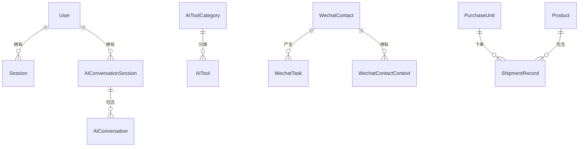

# SQLAlchemy 数据库体检报告

> 生成时间：2026-03-20  
> 项目：XCAGI  
> 数据库类型：SQLite + SQLAlchemy ORM

---

## 📊 一、数据库架构概览

### 1.1 数据库文件分布

系统采用**多数据库文件**架构，每个数据库文件负责不同的业务领域：

| 数据库文件 | 用途说明 | 主要表 |
|-----------|---------|--------|
| `products.db` | **主数据库**（默认） | products, shipment_records, wechat_tasks, wechat_contacts, materials 等 |
| `customers.db` | 客户管理数据库 | customers, purchase_units |
| `users.db` | 用户认证数据库 | users, sessions |
| `inventory.db` | 库存管理数据库 | (预留) |
| `voice_learning.db` | 语音学习数据库 | (预留) |
| `error_collection.db` | 错误收集数据库 | (预留) |

### 1.2 数据库配置核心

**配置文件位置：**
- [`app/db/base.py`](file:///e:/FHD/XCAGI/app/db/base.py) - SQLAlchemy 声明式基类
- [`app/db/__init__.py`](file:///e:/FHD/XCAGI/app/db/__init__.py) - 数据库引擎和 Session 配置
- [`app/db/init_db.py`](file:///e:/FHD/XCAGI/app/db/init_db.py) - 数据库路径管理和初始化

**SQLite 优化配置：**
```python
# 在数据库连接时自动执行以下优化参数
PRAGMA journal_mode=WAL          # WAL 模式，提升并发性能
PRAGMA synchronous=NORMAL        # 平衡性能和安全性
PRAGMA cache_size=-64000         # 64MB 缓存
PRAGMA foreign_keys=ON           # 启用外键约束
```

**数据库连接配置：**
```python
engine = create_engine(
    "sqlite:///products.db",
    connect_args={"check_same_thread": False},  # 允许多线程访问
    pool_pre_ping=True,                          # 连接前健康检查
    echo=False,                                  # 不打印 SQL 日志
)
```

---

## 📋 二、数据库模型详细清单

### 2.1 客户管理模块

#### **Customer** - 客户信息表
**文件：** [`app/db/models/customer.py`](file:///e:/FHD/XCAGI/app/db/models/customer.py)  
**表名：** `customers`

| 字段名 | 类型 | 约束 | 说明 |
|-------|------|------|------|
| id | Integer | PRIMARY KEY, INDEX | 客户 ID |
| customer_name | String(255) | NOT NULL, INDEX | 客户名称 |
| contact_person | String(100) | | 联系人 |
| contact_phone | String(50) | | 联系电话 |
| contact_address | String(500) | | 联系地址 |
| created_at | DateTime | DEFAULT NOW() | 创建时间 |
| updated_at | DateTime | DEFAULT NOW(), ON UPDATE | 更新时间 |

---

#### **PurchaseUnit** - 购买单位表
**文件：** [`app/db/models/purchase_unit.py`](file:///e:/FHD/XCAGI/app/db/models/purchase_unit.py)  
**表名：** `purchase_units`

| 字段名 | 类型 | 约束 | 说明 |
|-------|------|------|------|
| id | Integer | PRIMARY KEY, INDEX | 单位 ID |
| unit_name | String(255) | NOT NULL, INDEX | 单位名称 |
| contact_person | String(100) | | 联系人 |
| contact_phone | String(50) | | 联系电话 |
| address | String(500) | | 地址 |
| is_active | Boolean | DEFAULT TRUE | 是否启用 |
| created_at | DateTime | DEFAULT NOW() | 创建时间 |
| updated_at | DateTime | DEFAULT NOW(), ON UPDATE | 更新时间 |

**特殊说明：**
- 提供 `to_dict()` 方法，将 `unit_name` 映射为 `customer_name` 兼容前端
- 创建别名类 `Customer = PurchaseUnit` 保持向后兼容

---

### 2.2 产品管理模块

#### **Product** - 产品信息表
**文件：** [`app/db/models/product.py`](file:///e:/FHD/XCAGI/app/db/models/product.py)  
**表名：** `products`

| 字段名 | 类型 | 约束 | 说明 |
|-------|------|------|------|
| id | Integer | PRIMARY KEY, AUTOINCREMENT | 产品 ID |
| model_number | String | | 型号 |
| name | String | NOT NULL | 产品名称 |
| specification | String | | 规格 |
| price | Float | DEFAULT 0.0 | 价格 |
| quantity | Integer | | 数量 |
| description | String | | 描述 |
| category | String | | 分类 |
| brand | String | | 品牌 |
| unit | String | DEFAULT "个" | 单位 |
| is_active | Integer | DEFAULT 1 | 是否启用 |
| created_at | DateTime | | 创建时间 |
| updated_at | DateTime | | 更新时间 |

---

#### **Material** - 原材料表
**文件：** [`app/db/models/material.py`](file:///e:/FHD/XCAGI/app/db/models/material.py)  
**表名：** `materials`

| 字段名 | 类型 | 约束 | 说明 |
|-------|------|------|------|
| id | Integer | PRIMARY KEY, AUTOINCREMENT | 材料 ID |
| material_code | String | UNIQUE, NOT NULL | 材料编码 |
| name | String | NOT NULL | 材料名称 |
| category | String | | 分类 |
| specification | String | | 规格 |
| unit | String | DEFAULT "个" | 单位 |
| quantity | Float | DEFAULT 0 | 数量 |
| unit_price | Float | DEFAULT 0 | 单价 |
| supplier | String | | 供应商 |
| warehouse_location | String | | 仓库位置 |
| min_stock | Float | DEFAULT 0 | 最低库存 |
| max_stock | Float | DEFAULT 0 | 最高库存 |
| description | String | | 描述 |
| is_active | Integer | DEFAULT 1 | 是否启用 |
| created_at | DateTime | | 创建时间 |
| updated_at | DateTime | | 更新时间 |

---

### 2.3 发货管理模块

#### **ShipmentRecord** - 发货记录表
**文件：** [`app/db/models/shipment.py`](file:///e:/FHD/XCAGI/app/db/models/shipment.py)  
**表名：** `shipment_records`

| 字段名 | 类型 | 约束 | 说明 |
|-------|------|------|------|
| id | Integer | PRIMARY KEY, AUTOINCREMENT | 发货 ID |
| purchase_unit | String | NOT NULL | 购买单位名称 |
| unit_id | Integer | | 购买单位 ID（外键引用） |
| product_name | String | NOT NULL | 产品名称 |
| model_number | String | | 产品型号 |
| quantity_kg | Float | NOT NULL | 重量（kg） |
| quantity_tins | Integer | NOT NULL | 桶数 |
| tin_spec | Float | | 桶规格 |
| unit_price | Float | DEFAULT 0 | 单价 |
| amount | Float | DEFAULT 0 | 金额 |
| status | String | DEFAULT "pending" | 状态 |
| created_at | DateTime | | 创建时间 |
| updated_at | DateTime | | 更新时间 |
| printed_at | DateTime | | 打印时间 |
| printer_name | String | | 打印机名称 |
| raw_text | Text | | 原始文本 |
| parsed_data | Text | | 解析后的数据 |

---

### 2.4 用户认证模块

#### **User** - 用户表
**文件：** [`app/db/models/user.py`](file:///e:/FHD/XCAGI/app/db/models/user.py)  
**表名：** `users`

| 字段名 | 类型 | 约束 | 说明 |
|-------|------|------|------|
| id | Integer | PRIMARY KEY, AUTOINCREMENT | 用户 ID |
| username | String | UNIQUE, NOT NULL | 用户名 |
| password | String | NOT NULL | 密码（加密存储） |
| display_name | String | DEFAULT "" | 显示名 |
| role | String | DEFAULT "user" | 角色 |
| created_at | DateTime | | 创建时间 |
| last_login | DateTime | | 最后登录时间 |

---

#### **Session** - 用户会话表
**文件：** [`app/db/models/user.py`](file:///e:/FHD/XCAGI/app/db/models/user.py)  
**表名：** `sessions`

| 字段名 | 类型 | 约束 | 说明 |
|-------|------|------|------|
| id | Integer | PRIMARY KEY, AUTOINCREMENT | 会话 ID |
| session_id | String | UNIQUE, NOT NULL | 会话令牌 |
| user_id | Integer | NOT NULL | 用户 ID（外键引用） |
| created_at | DateTime | | 创建时间 |
| expires_at | DateTime | NOT NULL | 过期时间 |

---

### 2.5 AI 功能模块

#### **AIToolCategory** - AI 工具分类表
**文件：** [`app/db/models/ai.py`](file:///e:/FHD/XCAGI/app/db/models/ai.py)  
**表名：** `ai_tool_categories`

| 字段名 | 类型 | 约束 | 说明 |
|-------|------|------|------|
| id | Integer | PRIMARY KEY, AUTOINCREMENT | 分类 ID |
| category_name | String | NOT NULL | 分类名称 |
| category_key | String | UNIQUE, NOT NULL | 分类键 |
| description | String | | 描述 |
| icon | String | | 图标 |
| sort_order | Integer | DEFAULT 0 | 排序 |
| is_active | Integer | DEFAULT 1 | 是否启用 |
| created_at | DateTime | | 创建时间 |
| updated_at | DateTime | | 更新时间 |

---

#### **AITool** - AI 工具表
**文件：** [`app/db/models/ai.py`](file:///e:/FHD/XCAGI/app/db/models/ai.py)  
**表名：** `ai_tools`

| 字段名 | 类型 | 约束 | 说明 |
|-------|------|------|------|
| id | Integer | PRIMARY KEY, AUTOINCREMENT | 工具 ID |
| tool_key | String | UNIQUE, NOT NULL | 工具键 |
| name | String | NOT NULL | 工具名称 |
| category_id | Integer | | 分类 ID（外键引用） |
| description | String | | 描述 |
| parameters | String | | 参数配置（JSON） |
| is_active | Integer | DEFAULT 1 | 是否启用 |
| created_at | DateTime | | 创建时间 |
| updated_at | DateTime | | 更新时间 |

---

#### **AIConversation** - AI 对话记录表
**文件：** [`app/db/models/ai.py`](file:///e:/FHD/XCAGI/app/db/models/ai.py)  
**表名：** `ai_conversations`

| 字段名 | 类型 | 约束 | 说明 |
|-------|------|------|------|
| id | Integer | PRIMARY KEY, AUTOINCREMENT | 对话 ID |
| session_id | String | NOT NULL | 会话 ID |
| user_id | String | | 用户 ID |
| role | String | NOT NULL | 角色（user/assistant） |
| content | String | NOT NULL | 对话内容 |
| intent | String | | 意图识别 |
| conversation_metadata | String | | 元数据（JSON） |
| created_at | DateTime | | 创建时间 |

---

#### **AIConversationSession** - AI 对话会话表
**文件：** [`app/db/models/ai.py`](file:///e:/FHD/XCAGI/app/db/models/ai.py)  
**表名：** `ai_conversation_sessions`

| 字段名 | 类型 | 约束 | 说明 |
|-------|------|------|------|
| id | Integer | PRIMARY KEY, AUTOINCREMENT | 会话 ID |
| session_id | String | UNIQUE, NOT NULL | 会话唯一标识 |
| user_id | String | | 用户 ID |
| title | String | | 会话标题 |
| summary | String | | 会话摘要 |
| message_count | Integer | DEFAULT 0 | 消息数量 |
| last_message_at | DateTime | | 最后消息时间 |
| created_at | DateTime | | 创建时间 |

---

#### **UserPreference** - 用户偏好表
**文件：** [`app/db/models/ai.py`](file:///e:/FHD/XCAGI/app/db/models/ai.py)  
**表名：** `user_preferences`

| 字段名 | 类型 | 约束 | 说明 |
|-------|------|------|------|
| id | Integer | PRIMARY KEY, AUTOINCREMENT | 偏好 ID |
| user_id | String | NOT NULL | 用户 ID |
| preference_key | String | NOT NULL | 偏好键 |
| preference_value | String | | 偏好值 |
| created_at | DateTime | | 创建时间 |
| updated_at | DateTime | | 更新时间 |

---

### 2.6 微信功能模块

#### **WechatTask** - 微信任务表
**文件：** [`app/db/models/wechat.py`](file:///e:/FHD/XCAGI/app/db/models/wechat.py)  
**表名：** `wechat_tasks`

| 字段名 | 类型 | 约束 | 说明 |
|-------|------|------|------|
| id | Integer | PRIMARY KEY, AUTOINCREMENT | 任务 ID |
| contact_id | Integer | | 联系人 ID（外键引用） |
| username | String | | 微信用户名 |
| display_name | String | | 显示名 |
| message_id | String | | 消息 ID |
| msg_timestamp | Integer | | 消息时间戳 |
| raw_text | Text | NOT NULL | 原始消息文本 |
| task_type | String | NOT NULL, DEFAULT "unknown" | 任务类型 |
| status | String | NOT NULL, DEFAULT "pending" | 任务状态 |
| last_status_at | DateTime | DEFAULT NOW() | 最后状态时间 |
| created_at | DateTime | DEFAULT NOW() | 创建时间 |
| updated_at | DateTime | DEFAULT NOW() | 更新时间 |

**索引：**
- `idx_wechat_tasks_contact_status`: (contact_id, status) 联合索引
- `idx_wechat_tasks_msg_unique`: (message_id, username) 唯一索引

---

#### **WechatContact** - 微信联系人表
**文件：** [`app/db/models/wechat.py`](file:///e:/FHD/XCAGI/app/db/models/wechat.py)  
**表名：** `wechat_contacts`

| 字段名 | 类型 | 约束 | 说明 |
|-------|------|------|------|
| id | Integer | PRIMARY KEY, AUTOINCREMENT | 联系人 ID |
| contact_name | String | NOT NULL | 联系人名称 |
| remark | String | | 备注 |
| wechat_id | String | | 微信号 |
| contact_type | String | DEFAULT "contact" | 联系人类型 |
| is_active | Integer | DEFAULT 1 | 是否启用 |
| is_starred | Integer | DEFAULT 0 | 是否星标 |
| created_at | DateTime | DEFAULT NOW() | 创建时间 |
| updated_at | DateTime | DEFAULT NOW() | 更新时间 |

---

#### **WechatContactContext** - 微信联系人上下文表
**文件：** [`app/db/models/wechat.py`](file:///e:/FHD/XCAGI/app/db/models/wechat.py)  
**表名：** `wechat_contact_context`

| 字段名 | 类型 | 约束 | 说明 |
|-------|------|------|------|
| id | Integer | PRIMARY KEY, AUTOINCREMENT | 上下文 ID |
| contact_id | Integer | NOT NULL | 联系人 ID（外键引用） |
| wechat_id | String | | 微信号 |
| context_json | Text | | 上下文数据（JSON） |
| message_count | Integer | DEFAULT 0 | 消息数量 |
| updated_at | DateTime | DEFAULT NOW() | 更新时间 |

---

## 🔗 三、表关系分析

### 3.1 逻辑关系图



### 3.2 外键关系说明

| 子表 | 父表 | 关联字段 | 约束类型 |
|------|------|---------|---------|
| `sessions` | `users` | user_id → id | **逻辑关联**（无 FK 约束） |
| `ai_conversation_sessions` | `users` | user_id → id | **逻辑关联**（无 FK 约束） |
| `ai_conversations` | `ai_conversation_sessions` | session_id → session_id | **逻辑关联**（无 FK 约束） |
| `ai_tools` | `ai_tool_categories` | category_id → id | **逻辑关联**（无 FK 约束） |
| `wechat_tasks` | `wechat_contacts` | contact_id → id | **逻辑关联**（无 FK 约束） |
| `wechat_contact_context` | `wechat_contacts` | contact_id → id | **逻辑关联**（无 FK 约束） |
| `shipment_records` | `purchase_units` | unit_id → id | **逻辑关联**（无 FK 约束） |

**⚠️ 重要发现：**
- 所有表间关系都使用**逻辑关联**，未定义物理外键约束
- 好处：数据操作更灵活，避免外键约束导致的删除/更新失败
- 风险：可能出现孤儿记录，需要应用层维护数据一致性

---

## 🏗️ 四、仓储层架构（Repository Pattern）

### 4.1 仓储接口定义

**客户仓储接口：** [`app/infrastructure/repositories/customer_repository.py`](file:///e:/FHD/XCAGI/app/infrastructure/repositories/customer_repository.py)

**产品仓储接口：** [`app/infrastructure/repositories/product_repository.py`](file:///e:/FHD/XCAGI/app/infrastructure/repositories/product_repository.py)

**发货单仓储接口：** [`app/infrastructure/repositories/shipment_repository.py`](file:///e:/FHD/XCAGI/app/infrastructure/repositories/shipment_repository.py)

### 4.2 仓储实现

**客户仓储实现：** [`app/infrastructure/repositories/customer_repository_impl.py`](file:///e:/FHD/XCAGI/app/infrastructure/repositories/customer_repository_impl.py)
- 提供 Customer 和 PurchaseUnit 的 CRUD 操作
- 领域模型与数据库模型的转换方法
- 支持按名称模糊搜索

**产品仓储实现：** [`app/infrastructure/repositories/product_repository_impl.py`](file:///e:/FHD/XCAGI/app/infrastructure/repositories/product_repository_impl.py)
- 提供 Product 的 CRUD 操作
- 支持分页查询
- 支持按型号查找
- 支持按名称模糊搜索

**发货单仓储实现：** [`app/infrastructure/repositories/shipment_repository_impl.py`](file:///e:/FHD/XCAGI/app/infrastructure/repositories/shipment_repository_impl.py)
- 提供 ShipmentRecord 的 CRUD 操作
- 支持按购买单位查询

---

## 🔄 五、数据库迁移（Alembic）

### 5.1 配置文件

**Alembic 配置：** [`alembic.ini`](file:///e:/FHD/XCAGI/alembic.ini)
```ini
script_location = %(here)s/alembic
sqlalchemy.url = sqlite:///  # 在 env.py 中动态设置
```

**环境配置：** [`alembic/env.py`](file:///e:/FHD/XCAGI/alembic/env.py)
- 使用 `Base.metadata` 作为目标元数据
- 动态设置数据库 URL

### 5.2 迁移状态

**当前状态：** ⚠️ **仅配置，未充分使用**
- 已配置 Alembic 迁移框架
- 只有一个初始迁移脚本
- 大部分表通过 `create_all()` 直接创建

**建议：**
- 完善 Alembic 迁移脚本管理
- 所有表结构变更通过迁移脚本执行
- 避免在生产环境使用 `create_all()`

---

## 📁 六、数据库文件结构

### 6.1 模型注册机制

**模型汇总文件：** [`app/db/models/__init__.py`](file:///e:/FHD/XCAGI/app/db/models/__init__.py)

所有模型类通过此文件导入并注册到 `Base.metadata`：

```python
from app.db.models.purchase_unit import PurchaseUnit
from app.db.models.product import Product
from app.db.models.shipment import ShipmentRecord
from app.db.models.customer import Customer
from app.db.models.wechat import WechatTask, WechatContact, WechatContactContext
from app.db.models.user import User, Session as UserSession
from app.db.models.ai import (
    AIToolCategory,
    AITool,
    AIConversation,
    AIConversationSession,
    UserPreference,
)
from app.db.models.material import Material
```

### 6.2 数据库初始化流程

**初始化入口：** [`app/db/init_db.py`](file:///e:/FHD/XCAGI/app/db/init_db.py)

```python
# 1. 获取数据库文件路径
db_path = get_db_path("products.db")

# 2. 检查数据库文件是否存在
if not os.path.exists(db_path):
    # 3. 从种子数据库复制（如果存在）
    copy_from_seed("products.db")

# 4. 特殊表初始化（如 wechat_tasks）
init_wechat_tasks_table()
```

**支持的数据库文件：**
```python
DEFAULT_DB_FILES = (
    "products.db",
    "customers.db",
    "inventory.db",
    "voice_learning.db",
    "error_collection.db",
)
```

---

## 🔍 七、数据库健康状况评估

### 7.1 优点 ✅

1. **模块化设计**：多数据库文件分离，职责清晰
2. **SQLite 优化**：配置了 WAL 模式、缓存优化等参数
3. **ORM 规范化**：使用 SQLAlchemy ORM，代码可维护性好
4. **仓储模式**：引入 Repository Pattern，分层清晰
5. **时间戳管理**：大部分表有 created_at 和 updated_at 字段
6. **索引优化**：关键字段建立了索引（如 customer_name, username 等）
7. **兼容性设计**：PurchaseUnit 提供 to_dict() 方法兼容前端

### 7.2 待改进项 ⚠️

1. **缺少外键约束**
   - 所有表关系都是逻辑关联
   - 建议：在关键关系上添加 ForeignKey 约束

2. **数据完整性风险**
   - 可能出现孤儿记录
   - 建议：应用层增加数据一致性检查

3. **Alembic 迁移未充分利用**
   - 建议：完善迁移脚本管理
   - 避免在生产环境使用 create_all()

4. **缺少软删除机制**
   - 大部分表只有 is_active 字段
   - 建议：统一软删除实现

5. **缺少数据验证**
   - 建议：增加 SQLAlchemy 事件监听器
   - 在应用层增加数据验证逻辑

6. **索引覆盖不足**
   - 建议：为常用查询条件增加复合索引
   - 如：shipment_records 的 (purchase_unit, status)

7. **缺少数据库备份机制**
   - 建议：定期自动备份数据库文件
   - 实现 WAL 文件合并策略

### 7.3 性能建议 🚀

1. **连接池优化**
   - 当前配置：无连接池（SQLite 默认）
   - 建议：对于高并发场景，考虑使用 QueuePool

2. **查询优化**
   - 避免 N+1 查询问题
   - 使用 joinedload() 预加载关联数据

3. **批量操作**
   - 使用 bulk_insert_mappings() 进行批量插入
   - 减少数据库往返次数

4. **只读查询优化**
   - 对于统计类查询，使用 session.no_autoflush
   - 避免不必要的 flush 操作

---

## 📝 八、数据库使用示例

### 8.1 基本 CRUD 操作

```python
from sqlalchemy.orm import Session
from app.db import SessionLocal
from app.db.models import Customer, Product, ShipmentRecord

# 获取数据库会话
db = SessionLocal()

try:
    # 创建客户
    customer = Customer(
        customer_name="测试客户",
        contact_person="张三",
        contact_phone="13800138000"
    )
    db.add(customer)
    db.commit()
    db.refresh(customer)
    
    # 查询客户
    customer = db.query(Customer).filter(
        Customer.customer_name == "测试客户"
    ).first()
    
    # 更新客户
    customer.contact_phone = "13900139000"
    db.commit()
    
    # 删除客户
    db.delete(customer)
    db.commit()
    
finally:
    db.close()
```

### 8.2 关联查询示例

```python
# 查询某个购买单位的所有发货记录
purchase_unit = db.query(PurchaseUnit).filter(
    PurchaseUnit.unit_name == "某某公司"
).first()

shipments = db.query(ShipmentRecord).filter(
    ShipmentRecord.unit_id == purchase_unit.id
).all()

# 或者使用 join
shipments = db.query(ShipmentRecord).join(
    PurchaseUnit, ShipmentRecord.unit_id == PurchaseUnit.id
).filter(
    PurchaseUnit.unit_name == "某某公司"
).all()
```

### 8.3 分页查询示例

```python
# 产品分页查询
page = 1
page_size = 20
products = db.query(Product).filter(
    Product.is_active == 1
).offset((page - 1) * page_size).limit(page_size).all()

# 总数统计
total = db.query(Product).filter(
    Product.is_active == 1
).count()
```

---

## 📊 九、统计数据

### 9.1 表数量统计

| 分类 | 表数量 |
|------|-------|
| 客户管理 | 2 |
| 产品管理 | 2 |
| 发货管理 | 1 |
| 用户认证 | 2 |
| AI 功能 | 5 |
| 微信功能 | 3 |
| **总计** | **15** |

### 9.2 字段类型分布

| 类型 | 使用次数 | 占比 |
|------|---------|------|
| String | 67 | 45% |
| Integer | 38 | 26% |
| DateTime | 32 | 22% |
| Float | 12 | 8% |
| Text | 5 | 3% |
| Boolean | 1 | <1% |

---

## 🔧 十、维护建议

### 10.1 日常维护

1. **定期备份**
   - 每天备份一次数据库文件
   - 备份前执行 WAL 合并：`PRAGMA wal_checkpoint(TRUNCATE)`

2. **数据清理**
   - 定期清理过期的会话记录
   - 清理测试数据

3. **性能监控**
   - 监控慢查询日志
   - 定期检查索引使用情况

### 10.2 升级策略

1. **架构升级**
   - 从 SQLite 迁移到 PostgreSQL（如需要）
   - SQLAlchemy 配置基本兼容

2. **数据迁移**
   - 使用 Alembic 管理架构变更
   - 大数据量迁移使用批量操作

3. **回滚方案**
   - 每次迁移前备份数据库
   - 准备回滚脚本

---

## 📚 十一、相关文件清单

### 核心配置文件
- [`app/db/base.py`](file:///e:/FHD/XCAGI/app/db/base.py) - SQLAlchemy 基类
- [`app/db/__init__.py`](file:///e:/FHD/XCAGI/app/db/__init__.py) - 数据库引擎配置
- [`app/db/init_db.py`](file:///e:/FHD/XCAGI/app/db/init_db.py) - 数据库路径管理
- [`alembic.ini`](file:///e:/FHD/XCAGI/alembic.ini) - Alembic 配置
- [`alembic/env.py`](file:///e:/FHD/XCAGI/alembic/env.py) - Alembic 环境配置

### 模型文件
- [`app/db/models/__init__.py`](file:///e:/FHD/XCAGI/app/db/models/__init__.py) - 模型汇总
- [`app/db/models/customer.py`](file:///e:/FHD/XCAGI/app/db/models/customer.py) - 客户模型
- [`app/db/models/purchase_unit.py`](file:///e:/FHD/XCAGI/app/db/models/purchase_unit.py) - 购买单位模型
- [`app/db/models/product.py`](file:///e:/FHD/XCAGI/app/db/models/product.py) - 产品模型
- [`app/db/models/material.py`](file:///e:/FHD/XCAGI/app/db/models/material.py) - 原材料模型
- [`app/db/models/shipment.py`](file:///e:/FHD/XCAGI/app/db/models/shipment.py) - 发货记录模型
- [`app/db/models/user.py`](file:///e:/FHD/XCAGI/app/db/models/user.py) - 用户和会话模型
- [`app/db/models/ai.py`](file:///e:/FHD/XCAGI/app/db/models/ai.py) - AI 功能模型
- [`app/db/models/wechat.py`](file:///e:/FHD/XCAGI/app/db/models/wechat.py) - 微信功能模型

### 仓储层文件
- [`app/infrastructure/repositories/customer_repository.py`](file:///e:/FHD/XCAGI/app/infrastructure/repositories/customer_repository.py) - 客户仓储接口
- [`app/infrastructure/repositories/customer_repository_impl.py`](file:///e:/FHD/XCAGI/app/infrastructure/repositories/customer_repository_impl.py) - 客户仓储实现
- [`app/infrastructure/repositories/product_repository.py`](file:///e:/FHD/XCAGI/app/infrastructure/repositories/product_repository.py) - 产品仓储接口
- [`app/infrastructure/repositories/product_repository_impl.py`](file:///e:/FHD/XCAGI/app/infrastructure/repositories/product_repository_impl.py) - 产品仓储实现
- [`app/infrastructure/repositories/shipment_repository.py`](file:///e:/FHD/XCAGI/app/infrastructure/repositories/shipment_repository.py) - 发货单仓储接口
- [`app/infrastructure/repositories/shipment_repository_impl.py`](file:///e:/FHD/XCAGI/app/infrastructure/repositories/shipment_repository_impl.py) - 发货单仓储实现

---

## 🎯 总结

本数据库架构整体设计合理，采用 SQLAlchemy ORM 进行数据管理，具有良好的可维护性和扩展性。主要特点：

✅ **架构清晰**：多数据库文件分离，职责明确  
✅ **ORM 规范**：使用 SQLAlchemy 声明式模型  
✅ **分层设计**：引入 Repository Pattern  
✅ **性能优化**：SQLite 参数调优到位  

⚠️ **改进方向**：
- 加强外键约束管理
- 完善 Alembic 迁移体系
- 增加数据验证机制
- 补充复合索引优化查询

建议按照本报告的建议逐步优化，提升数据库的健壮性和性能。
