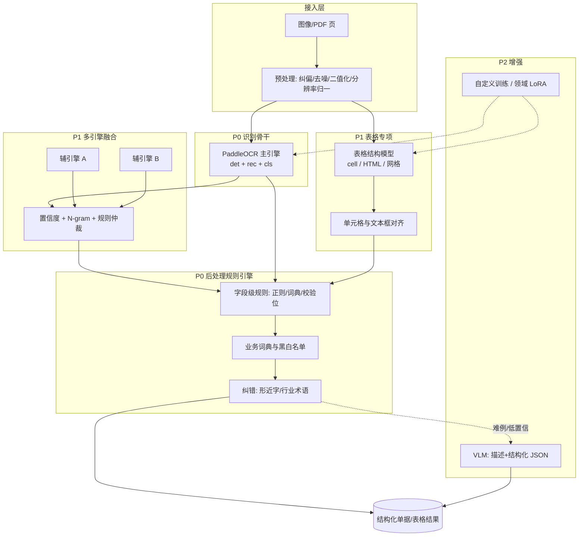
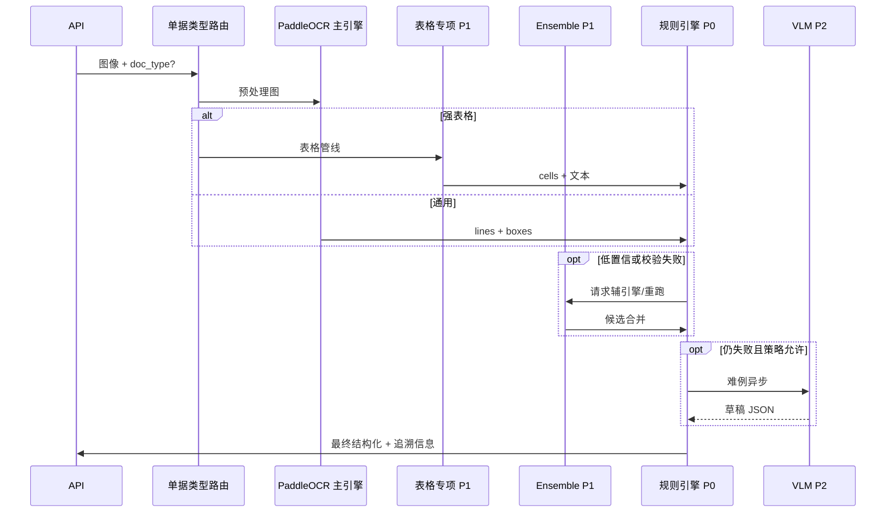

# OCR 优化架构（按优先级演进）

本文将下列能力组织成**可落地的分层架构**：PaddleOCR 主线替换、后处理规则引擎（P0）；表格专项与多引擎融合（P1）；行业微调与 VLM 混合（P2）。

> **用语**：「PaddleOCR 替换」指以 **PaddleOCR 作为默认识别骨干**，替换现有栈中的 EasyOCR、Tesseract 等方案；而非弃用 PaddleOCR。

| 能力 | 优先级 | 价值 | 说明 |
|------|--------|------|------|
| PaddleOCR 替换 | **P0** | ⭐⭐⭐⭐⭐ | 以 PaddleOCR 作为默认识别骨干，替换 EasyOCR / Tesseract 等通用栈，统一检测+识别+方向分类 |
| 后处理规则引擎 | **P0** | ⭐⭐⭐⭐ | 字典纠错、单号/金额/日期正则、业务词典、版面锚点约束，把「字符正确率」转化为「字段可用率」 |
| 表格专项模型 | **P1** | ⭐⭐⭐⭐ | 表格结构识别 / TableRecognition / PP-Structure 管线，与单元格 OCR 对齐 |
| 多引擎 Ensemble | **P1** | ⭐⭐⭐⭐ | 多引擎并行或级联投票，按置信度与规则仲裁输出 |
| 自定义训练 | **P2** | ⭐⭐⭐ | 特定行业字形、模板、印章干扰等，小样本微调或领域数据重训 |
| VLM 混合 | **P2** | ⭐⭐⭐⭐ | 大模型读图+推理，处理严重污损、非常规版式、语义填槽 |

---

## 总体架构

**读图顺序（推荐）**

1. 所有图像先经 **预处理** 再进 **PaddleOCR 主引擎**（P0）。
2. **表格类单据** 并行或下游启用 **表格专项管线**（P1），输出与文本框对齐后的「逻辑表」。
3. **规则引擎**（P0）对全引擎输出做字段抽取与校验；不依赖某一引擎的私有格式，输入统一为「带 bbox + 置信度的文本列表 + 可选表格网格」。
4. **Ensemble**（P1）：在关键字段上对多引擎结果做仲裁，降低成本的路径是「仅对低置信度区域触发辅引擎」。
5. **P2**：难例走 VLM 或回流标注后 **自定义训练**，再收紧规则集。

---

## 分层说明

### P0：PaddleOCR 替换（骨干）

- **目标**：单一、可维护、中文与印刷体场景性价比最高的默认路径。
- **替换对象**：历史栈中的 EasyOCR、纯 Tesseract 等（如 `XCAGI` 内 `OCRService` 以 `readtext` 为主的实现）。
- **交付物**：统一 `OcrResult` 契约（文本、多边形框、置信度、行/段排序键），供规则引擎与表格对齐消费。
- **仓库对照**：根目录 `scripts/test_paddleocr*.py`、`hybrid_table_recognition.py` 等可作为能力验证脚本，后续应收敛为可 import 的服务模块而非散脚本。

### P0：后处理规则引擎（业务价值放大器）

- **输入**：结构化 OCR 候选 + 可选表格 cell 映射。
- **能力分层**：
  - **通用层**：手机号、统一社会信用代码、金额、日期、身份证号等正则 + 校验位。
  - **业务层**：产品型号、客户简称、仓库代码等业务词典；字段间约束（如「数量 × 单价 ≈ 金额」容差）。
  - **纠错层**：形近字映射表、OCR 常见混淆对（0/O、1/l、8/B）。
- **输出**：字段级 `value + confidence + source + applied_rules[]`，便于审计与迭代。
- **原则**：规则与引擎解耦，可独立发版；AB 测试按单据类型切换规则包版本。

### P1：表格专项模型

- **触发**：版面分析判定为「强表格」或单据类型为出货单/对账单等。
- **路径**：PaddleOCR 表格类 API（如 `TableRecognitionPipelineV2`、PP-Structure）与 **单元格级文本** 对齐；复杂合并单元格可结合 OpenCV 网格或专用表格模型。
- **仓库对照**：`scripts/test_table_pipeline.py`、`test_ppstructure.py`、`ocr_table_*.py`。

### P1：多引擎 Ensemble

- **策略**：
  - **并行全量**：成本高，适合关键路径短请求。
  - **级联**：主引擎置信度低于阈值或对校验位失败时，再调用辅引擎（如第二套 Paddle 配置 / 不同分辨率重跑）。
  - **区域级**：仅对检测框置信度低的 ROI 裁剪重识。
- **仲裁**：同字段多候选时，综合 `engine_confidence`、规则匹配度、语言模型打分（可选轻量 LM）。

### P2：自定义训练（特定行业）

- **适用**：固定模板、稀有字体、印章遮盖、行业符号。
- **做法**：增量数据标注 → 检测/识别子模块微调或整图端到端小模型；与主线 Paddle 版本冻结对齐，避免线上漂移。
- **门禁**：离线集上对比 **字段级 F1**，而非仅字符编辑距离。

### P2：VLM 混合

- **适用**：规则与 OCR 置信度均低、版式自由、手写批注、多栏混排。
- **形态**：图像 + 提示词 → 结构化 JSON（与下游 ERP 字段对齐）；成本与时延高，宜 **异步队列 + 人工抽检闭环**。
- **注意**：VLM 输出必须经过同一套 **规则引擎校验**，防止幻觉字段直接进入生产。

---

## 请求级编排（伪流程）

---

## 实施顺序建议

1. **P0**：落地 PaddleOCR 统一服务 + `OcrResult` 契约；把现有 HTTP/Flask OCR 入口切到该实现。
2. **P0**：上线规则引擎 MVP（正则 + 业务词典 + 简单纠错表），打通「识别 → 字段」指标看板。
3. **P1**：按单据类型接入表格管线；Ensemble 先做「低置信重跑」最小集。
4. **P2**：积累难例集 → 微调；VLM 仅对标记类型或队列阈值触发。

---

## 相关文档

- 通用技术栈：[TECH_STACK.md](./TECH_STACK.md)
- 性能与压测：[PERFORMANCE_LOAD_TESTING.md](./PERFORMANCE_LOAD_TESTING.md)
